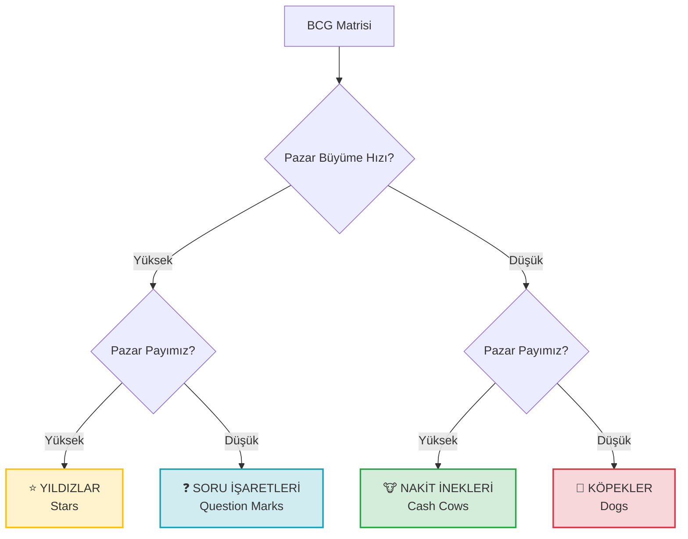

# BCG Matrisi (Büyüme/Pay Matrisi)

**Kategori:** Stratejik Analiz ve Portföy Yönetimi

## 1. Yönetici Özeti (TL;DR)
BCG Matrisi; bir şirketin ürünlerini veya hizmetlerini **Pazar Büyüme Hızı** ve **Pazar Payı** eksenlerinde sınıflandırarak, hangi ürüne yatırım yapılmasına veya hangisinin sonlandırılmasına karar vermeye yarayan bir portföy yönetim aracıdır.

* **Amaç:** Nakit akışını dengelemek ve yatırımları doğru projelere yönlendirmek.
* **Kullanım Alanı:** Birden fazla ürünü/hizmeti olan şirketlerde kaynak tahsisi yaparken.

---

## 2. Kökeni ve Tarihçesi
* **Ortaya Çıkış:** 1968.
* **Yaratıcısı:** Boston Consulting Group (BCG) kurucusu **Bruce Henderson**.
* **Hikayesi:** Şirketlerin nakit akışını yönetmek için geliştirilmiştir. "Deneyim Eğrisi" (Experience Curve) teorisine dayanır; pazar payı yüksek olanın maliyeti düşer ve kârı artar mantığını savunur.

---

## 3. Modelin Temel Yapısı (4 Kategori)

Matris, dikey eksende **Pazarın Büyüme Hızını** (Cazibe), yatay eksende ise **Şirketin Pazar Payını** (Güç) gösterir.

### 📋 Detaylı Açıklama

| Kategori | Özellik | Strateji | Nakit Durumu |
| :--- | :--- | :--- | :--- |
| **⭐ Yıldızlar (Stars)** | **Yüksek Büyüme / Yüksek Pazar Payı** Pazarın lideridir ve pazar hızla büyüyordur. | **Yatırım Yap:** Liderliği korumak için kazandığını buraya harca. Geleceğin "Nakit İneği" olacaktır. | Nötr (Çok kazanır ama çok harcar). |
| **🐮 Nakit İnekleri (Cash Cows)** | **Düşük Büyüme / Yüksek Pazar Payı** Pazar doymuştur ama biz liderizdir. Rekabet azdır. | **Sömür (Milk):** Yatırım yapma, sadece bakım yap. Buradan gelen nakidi "Yıldızları" beslemek için kullan. | Pozitif (Çok nakit üretir). |
| **❓ Soru İşaretleri (Question Marks)** | **Yüksek Büyüme / Düşük Pazar Payı** Pazar çok caziptir ama biz gerideyizdir. | **Karar Ver:** Ya agresif yatırım yapıp "Yıldıza" çevir ya da vazgeç. | Negatif (Çok nakit yer). |
| **🐶 Köpekler (Dogs)** | **Düşük Büyüme / Düşük Pazar Payı** Pazar ölüdür, bizim payımız da düşüktür. | **Tasfiye Et:** Kârlı değilse sat veya kapat. Kaynak israfıdır. | Nötr/Negatif. |

---

## 4. Uygulama Adımları

1.  **Ürünleri/Projeleri Listele:** Şirketin tüm gelir kalemlerini çıkarın.
2.  **Pazarı Ölç:** Her ürünün bulunduğu pazar yılda % kaç büyüyor?
3.  **Gücünü Ölç:** En büyük rakibe göre pazar payımız ne? (Örn: Rakip %40, biz %20 isek göreceli payımız 0.5'tir).
4.  **Matrise Yerleştir:** Her ürünü ilgili kutuya koyun.
5.  **Dengeyi Kur:**
    * *Hiç Nakit İneği yoksa:* Yeni projeleri finanse edemezsiniz.
    * *Hiç Yıldız yoksa:* Geleceğiniz yok demektir.

---

## 5. Kritik Sorular

* **Yıldızlar:** Pazar doygunluğa ulaştığında bu ürün "İnek" olmaya hazır mı?
* **Nakit İnekleri:** Buradan gelen parayı verimli kullanıyor muyuz, yoksa "Köpeklere" mi harcıyoruz?
* **Soru İşaretleri:** Bu projeyi "Yıldız" yapmak için gereken milyon dolara sahip miyiz? Değilsek neden uğraşıyoruz?
* **Köpekler:** Duygusal bağımız yüzünden mi bu zarardaki projeyi yaşatıyoruz?

---

## 6. Avantajlar ve Kısıtlar

### ✅ Avantajları
* **Basitlik:** Karmaşık portföyleri tek resimde gösterir.
* **Nakit Odaklılık:** Şirketin finansal sağlığını ve nakit akışını merkeze alır.
* **Disiplin:** Zarar eden, "hobi" amaçlı projeleri (Köpekleri) kapatmak için rasyonel gerekçe sunar.

### ⚠️ Kısıtları
* **Sadece İki Boyut:** Bazen düşük pazar payına sahip "Niş" ürünler de çok kârlı olabilir, model bunu kaçırır.
* **Pazar Tanımı:** Pazarı nasıl tanımladığınız sonucu değiştirir (Örn: "Lüks Kahve" pazarı mı, "Tüm İçecekler" pazarı mı?).
* **Sinerji Yokluğu:** Bazen bir "Köpek" ürünü, bir "Yıldız" ürününün satışını destekliyor olabilir.

---

## 7. Örnek Senaryo: "CodeBrew" (Proje Portföyü)

**Senaryo:** CodeBrew'un elindeki 4 farklı iş kolunu analiz ediyoruz.

| Proje / Ürün | Durum | Kategori | Strateji |
| :--- | :--- | :--- | :--- |
| **Endüstriyel Bakım Anlaşmaları** | Pazar büyümüyor (sabit), ama CodeBrew bölgedeki fabrikaların %60'ına hizmet veriyor. | **🐮 Nakit İneği** | **Sömür:** Buradan gelen düzenli parayı al, Ar-Ge'ye aktar. Ekstra pazarlama yapma. |
| **Yeni IoT Platformu (SaaS)** | Pazar patlama yaşıyor (Yüksek Büyüme), CodeBrew pazara yeni girdi ve payı çok düşük. | **❓ Soru İşareti** | **Karar:** Ya tüm nakdi buraya gömüp lider olmaya çalış ya da projeyi sat. Arada kalma. |
| **Özel Savunma Sanayi Projesi** | Sektör hızlı büyüyor ve CodeBrew bu spesifik niş alanda bilinen tek firma (Yüksek Pay). | **⭐ Yıldız** | **Yatırım Yap:** Rakipler girmeden yerini sağlamlaştır. Geleceğin ana gelir kaynağı bu olacak. |
| **Eski Masaüstü Muhasebe Yazılımı** | Artık herkes bulut kullanıyor (Pazar küçülüyor), CodeBrew'un sadece 3 müşterisi kaldı. | **🐶 Köpek** | **Öldür:** Sunucu maliyetine değmez. Müşterileri başka firmaya devret ve kapat. |

**Sonuç:** CodeBrew, "Bakım Anlaşmaları"ndan (İnek) kazandığı parayı, "Savunma Projesi"ni (Yıldız) büyütmek için kullanmalı. "IoT Platformu" (Soru İşareti) için ise bir yatırımcı aramalıdır.

---
🔙 [Ana Sayfaya Dön](../../README.tr.md)