# BCG Matrix (Growth-Share Matrix)

**Category:** Strategic Analysis and Portfolio Management

## 1. Executive Summary (TL;DR)
The BCG Matrix is a portfolio management tool used to classify a company's products or services based on **Market Growth Rate** and **Relative Market Share**, helping to decide which products to invest in or discontinue.

* **Purpose:** To balance cash flow and direct investments to the right projects.
* **Use Cases:** Resource allocation in companies with multiple products/services.

---

## 2. Origin and History
* **Emergence:** 1968.
* **Creator:** Boston Consulting Group (BCG) founder **Bruce Henderson**.
* **Story:** Developed to manage corporate cash flow. It is based on the "Experience Curve" theory; arguing that higher market share leads to lower costs and higher profits.

---

## 3. Basic Structure of the Model (4 Categories)

The matrix shows **Market Growth Rate** (Attractiveness) on the vertical axis and **Relative Market Share** (Strength) on the horizontal axis.

```mermaid
graph TD
    A[BCG Matrix] --> B{Market Growth Rate?}
    
    B -- High --> C{Market Share?}
    B -- Low --> D{Market Share?}
    
    C -- High --> S[⭐ STARS]
    C -- Low --> Q[❓ QUESTION MARKS]
    
    D -- High --> CASH[🐮 CASH COWS]
    D -- Low --> DOG[🐶 DOGS]
    
    style S fill:#fff3cd,stroke:#ffc107,stroke-width:2px
    style Q fill:#d1ecf1,stroke:#17a2b8,stroke-width:2px
    style CASH fill:#d4edda,stroke:#28a745,stroke-width:2px
    style DOG fill:#f8d7da,stroke:#dc3545,stroke-width:2px
```

### 📋 Detailed Explanation

| Category | Feature | Strategy | Cash Status |
| :--- | :--- | :--- | :--- |
| **⭐ Stars** | **High Growth / High Market Share** Leader in a fast-growing market. | **Invest:** Spend what you earn to maintain leadership. Will become a future "Cash Cow". | Neutral (Earns a lot but spends a lot). |
| **🐮 Cash Cows** | **Low Growth / High Market Share** Market is saturated but we are the leader. Competition is low. | **Milk:** Do not invest heavily, just maintain. Use the cash generated here to feed "Stars". | Positive (Generates a lot of cash). |
| **❓ Question Marks** | **High Growth / Low Market Share** Market is very attractive but we are behind. | **Decide:** Either invest aggressively to turn into a "Star" or divest. | Negative (Consumes a lot of cash). |
| **🐶 Dogs** | **Low Growth / Low Market Share** Market is dead and our share is low. | **Divest:** Sell or close if not profitable. It is a waste of resources. | Neutral/Negative. |

---

## 4. Implementation Steps

1.  **List Products/Projects:** List all revenue streams of the company.
2.  **Measure Market:** How much does the market for each product grow annually (%)?
3.  **Measure Strength:** What is our market share relative to the largest competitor? (e.g., Competitor 40%, us 20% -> relative share is 0.5).
4.  **Plot on Matrix:** Place each product in the relevant box.
5.  **Balance:**
    * *No Cash Cows:* You cannot fund new projects.
    * *No Stars:* You have no future.

---

## 5. Critical Questions

* **Stars:** Is this product ready to become a "Cow" when the market saturates?
* **Cash Cows:** Are we using the money generated here efficiently, or wasting it on "Dogs"?
* **Question Marks:** do we have the millions required to make this project a "Star"? If not, why bother?
* **Dogs:** Are we keeping this loss-making project alive due to emotional attachment?

---

## 6. Advantages and Constraints

### ✅ Advantages
* **Simplicity:** Shows complex portfolios in a single picture.
* **Cash Focus:** Puts the company's financial health and cash flow at the center.
* **Discipline:** Provides a rational justification for closing loss-making, "hobby" projects (Dogs).

### ⚠️ Constraints
* **Only Two Dimensions:** Sometimes "Niche" products with low market share can be very profitable; the model misses this.
* **Market Definition:** How you define the market changes the result (e.g., "Luxury Coffee" market vs. "All Beverages" market?).
* **Lack of Synergy:** Sometimes a "Dog" product might be supporting the sales of a "Star" product.

---

## 7. Example Scenario: "CodeBrew" (Project Portfolio)

**Scenario:** We are analyzing 4 different business lines of CodeBrew.

| Project / Product | Status | Category | Strategy |
| :--- | :--- | :--- | :--- |
| **Industrial Maintenance Contracts** | Market not growing (stable), but CodeBrew serves 60% of factories in the region. | **🐮 Cash Cow** | **Milk:** Take the steady cash and transfer to R&D. No extra marketing. |
| **New IoT Platform (SaaS)** | Market exploding (High Growth), CodeBrew just entered and share is very low. | **❓ Question Mark** | **Decide:** Either sink all cash here to become a leader or sell the project. Don't stay in between. |
| **Special Defense Project** | Sector growing fast and CodeBrew is the only known firm in this specific niche (High Share). | **⭐ Star** | **Invest:** Solidify position before competitors enter. This will be the main revenue source of the future. |
| **Old Desktop Accounting Software** | Everyone uses cloud now (Market shrinking), CodeBrew has only 3 clients left. | **🐶 Dog** | **Kill:** Not worth the server cost. Transfer clients to another firm and close. |

**Conclusion:** CodeBrew should use the money earned from "Maintenance Contracts" (Cow) to grow the "Defense Project" (Star). It should look for an investor for the "IoT Platform" (Question Mark).

---
🔙 [Back to Home](../../README.md)