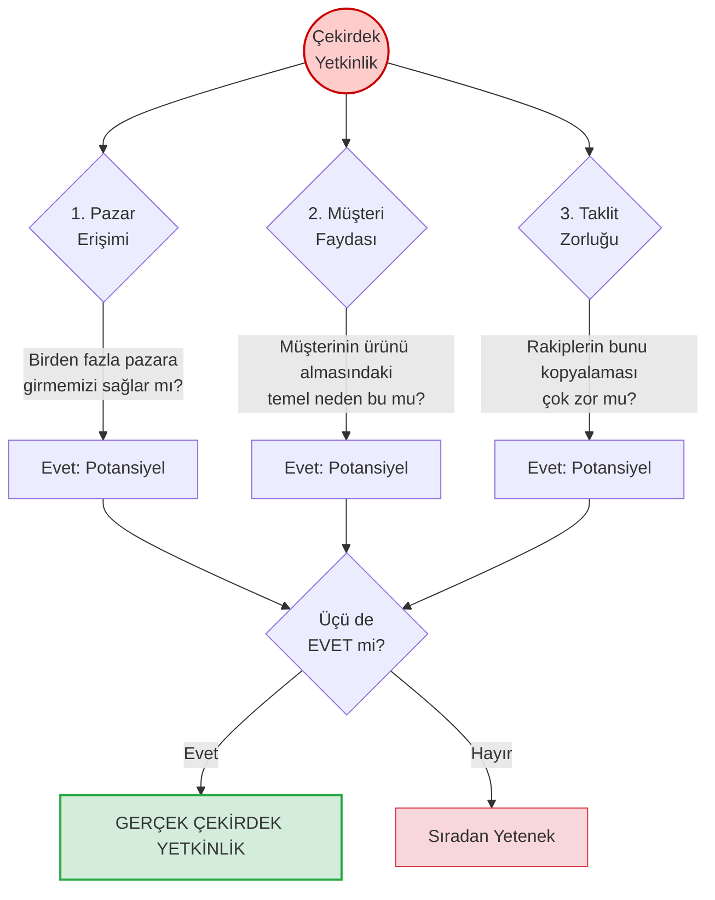

# Çekirdek Yetkinlik Analizi (Core Competence Analysis)

**Kategori:** Stratejik Analiz ve Durum Değerlendirme (İçsel Analiz)

## 1. Yönetici Özeti (TL;DR)
Çekirdek Yetkinlik Analizi; bir şirketin sadece tek bir üründe değil, birden fazla pazarda ve üründe rekabet avantajı sağlamasına olanak tanıyan, rakipler tarafından kolayca kopyalanamayan derin bilgi birikimi ve yetenekler setini tanımlar.

* **Amaç:** Şirketi diğerlerinden ayıran ve "gerçekten çok iyi yaptığı" kök yetenekleri keşfetmek.
* **Felsefe:** Şirket bir ağaç gibidir. Ürünler yapraklar, iş birimleri dallardır. Ağacı ayakta tutan ve besleyen ise görünmeyen kökler, yani "Çekirdek Yetkinlikler"dir.
* **Kullanım Alanı:** Yeni pazarlara girme kararlarında, şirket birleşmelerinde ve uzun vadeli stratejik vizyon oluşturmada.

---

## 2. Kökeni ve Tarihçesi
* **Ortaya Çıkış:** 1990.
* **Yaratıcıları:** **C.K. Prahalad** ve **Gary Hamel**.
* **Kaynak:** Harvard Business Review'da yayımlanan ünlü "The Core Competence of the Corporation" (Şirketin Çekirdek Yetkinliği) adlı makale.
* **Paradigma Değişimi:** O döneme kadar şirketler sadece ürettikleri nihai ürünlerle anılıyordu (Örn: Honda = Motosiklet). Bu teori ile Honda'nın asıl gücünün ürün değil, "küçük ve verimli motor tasarlama yetkinliği" olduğu anlaşıldı.

---

## 3. Modelin Temel Yapısı (Çekirdek Yetkinlik Testi)

Bir yeteneğin "Çekirdek Yetkinlik" sayılabilmesi için aşağıdaki 3 zorlu testi de geçmesi gerekir:

### 📋 Detaylı Açıklama (3 Kriter)

| Kriter | Açıklama |
| :--- | :--- |
| **1. Geniş Pazar Erişimi (Market Access)** | Çekirdek yetkinliğiniz sizi tek bir ürüne hapsetmemeli, tamamen farklı pazarların kapısını açabilmelidir. *(Örn: Casio'nun "minyatürleştirme" yetkinliği sadece saat üretmesini değil, hesap makinesi ve cep televizyonu üretmesini de sağladı).* |
| **2. Algılanan Müşteri Faydası (Customer Benefit)** | Müşterinin ürünü seçmesindeki asıl katma değer olmalıdır. Gizli bir süreç değil, müşterinin doğrudan hissettiği bir faydadır. *(Örn: Volvo'nun "Güvenlik" yetkinliği).* |
| **3. Taklit Edilemezlik (Inimitability)** | Rakiplerin parayla anında satın alamayacağı karmaşık bir teknolojiler, süreçler ve beceriler harmonisidir. Sadece bir makine değil, kurum kültürüyle harmanlanmış bir bilgi birikimidir. |

---

## 4. Uygulama Adımları

1. **Yetenek Envanterini Çıkarın:** Şirketinizin iyi yaptığı her şeyi (satış, kodlama, lojistik, müşteri hizmetleri) listeleyin.
2. **Test Süzgecinden Geçirin:** Listedeki her yeteneği yukarıdaki 3 soruyla (Pazar, Fayda, Taklit) test edin.
3. **Kökü Bulun:** Ürünlere değil, o ürünleri yapmanızı sağlayan yeteneğe odaklanın. (Sony'nin ürünü Walkman'di, ama çekirdek yetkinliği "ses sistemlerini küçültme ve taşınabilir yapma" becerisiydi).
4. **Çekirdek Ürünlere (Core Products) Dönüştürün:** Bu yetkinliği kullanarak hangi "ara ürünleri" veya "platformları" üretebileceğinizi planlayın.

---

## 5. Kritik Sorular

* Müşteriler bizim logomuzu sildiğinde, bu ürünün bize ait olduğunu o benzersiz dokunuşumuzdan anlayabilirler mi?
* Eğer ana ürünümüzün (Örn: Masaüstü yazılım) modası geçerse, elimizdeki yetenekleri kullanarak başka hangi sektöre hızla girebiliriz?
* Rakibimiz devasa bir bütçeyle karşımıza çıksa bile, bizden hemen kopyalayamayacağı o "gizli tarifimiz" nedir?

---

## 6. Avantajlar ve Kısıtlar

### ✅ Avantajları
* **Uzun Vadeli Büyüme:** Şirketi tek bir ürünün ölümüne (Product Life Cycle) mahkum olmaktan kurtarır.
* **Stratejik Esneklik:** Pazar dinamikleri değiştiğinde, kök sağlam olduğu için yeni ürün/dallarla hayatta kalmayı sağlar.
* **Kaynak Odaklanması:** Tüm şirketin Ar-Ge ve eğitim bütçesinin nereye yatırılacağını netleştirir.

### ⚠️ Kısıtları
* **Körlük (Core Rigidity):** Bugüne kadar başarı getiren çekirdek yetkinliğe aşırı aşık olmak, yeni teknolojileri (yıkıcı inovasyonları) kaçırmaya neden olabilir.
* **Tespiti Zordur:** Şirketler genellikle "Çekirdek Yetkinlik" ile "İyi yapılan sıradan bir işi" birbirine karıştırır. Her güçlü yön çekirdek yetkinlik değildir.

---

## 7. Örnek Senaryo: "CodeBrew" (Yetkinlik Tespiti)

**Senaryo:** CodeBrew firması kendisini "HMI ekranları programlayan bir yazılım ofisi" olarak tanımlıyor. Ancak bu bir çekirdek yetkinlik testi için fazla sığdır. CodeBrew'un gerçek yetkinliğini bulalım:

| Yetenek Adayı | 1. Çeşitli Pazarlara Girdirir mi? | 2. Müşteri Faydası Sağlar mı? | 3. Taklidi Zor mu? | Sonuç |
| :--- | :--- | :--- | :--- | :--- |
| **Altium'da PCB Çizmek** | Evet (Her sektörün karta ihtiyacı var). | Hayır (Müşteri PCB'nin nasıl çizildiğiyle ilgilenmez, çalışmasına bakar). | Hayır (Piyasada yüzlerce iyi donanımcı var). | *Sıradan Yetenek* |
| **C/C++ Kodlamak** | Evet. | Evet. | Hayır (Dil herkes tarafından öğrenilebilir). | *Sıradan Yetenek* |
| **Zorlu Endüstriyel Koşullar için (Ex-proof, Gürültülü) Donanım ve Gömülü Yazılımı Hızla Entegre Etmek** | **Evet** (Savunma, Medikal, Otomotiv, Madencilik her alana uygulanabilir). | **Evet** (Cihazın sahada çökmemesi müşterinin en büyük arzusu). | **Evet** (Sadece kod bilmek yetmez; fizik, elektromanyetik gürültü ve sektörel standart tecrübesi yıllar alır). | **GERÇEK ÇEKİRDEK YETKİNLİK** |

**Sonuç:** CodeBrew'un vizyonu "Ekran programcısı" olmak değil, **"Zorlu endüstriyel koşullarda hatasız çalışan gömülü sistemlerin hızlı mimarı"** olmaktır. İleride ekranlar kalkıp holograma geçilse bile, CodeBrew bu çekirdek yetkinliğiyle yeni teknolojiyi de endüstriye aynı hız ve güvenle entegre edebilecektir.

---
🔙 [Ana Sayfaya Dön](../../README.tr.md)