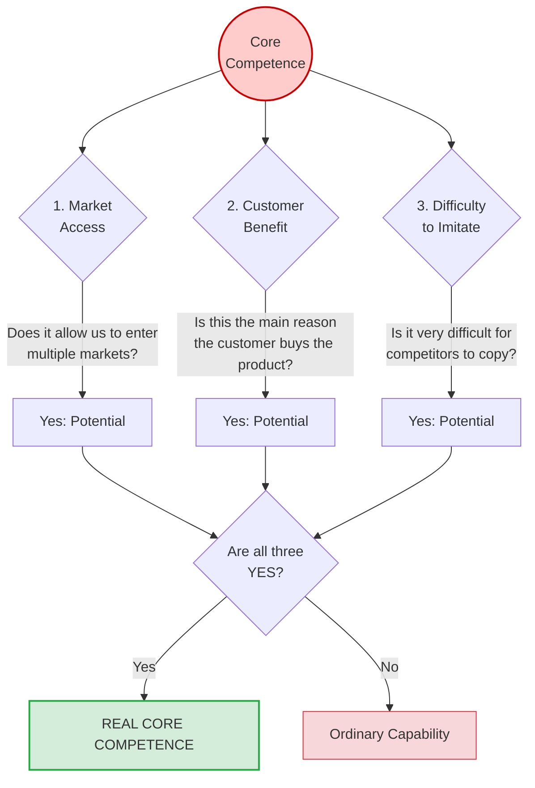

# Core Competence Analysis

**Category:** Strategic Analysis and Situation Assessment (Internal Analysis)

## 1. Executive Summary (TL;DR)
Core Competence Analysis defines a set of deep knowledge and skills that allows a company to achieve a competitive advantage not just in a single product, but across multiple markets and products, and cannot be easily copied by competitors.

* **Purpose:** To discover the root capabilities that distinguish the company from others and what it "does really well".
* **Philosophy:** A company is like a tree. Products are leaves, business units are branches. What keeps the tree standing and feeds it are the invisible roots, namely the "Core Competencies".
* **Use Cases:** When deciding to enter new markets, in mergers and acquisitions, and when creating a long-term strategic vision.

---

## 2. Origin and History
* **Emergence:** 1990.
* **Creators:** **C.K. Prahalad** and **Gary Hamel**.
* **Source:** The famous article "The Core Competence of the Corporation" published in the Harvard Business Review.
* **Paradigm Shift:** Until then, companies were known only for the final products they produced (e.g., Honda = Motorcycles). With this theory, it was understood that Honda's real power was not the product, but its "competence in designing small and efficient engines".

---

## 3. Basic Structure of the Model (Core Competence Test)

For a capability to be considered a "Core Competence," it must pass all 3 of the following rigorous tests:

### 📋 Detailed Explanation (3 Criteria)

| Criterion | Explanation |
| :--- | :--- |
| **1. Market Access** | Your core competence should not confine you to a single product; it should open the doors to completely different markets. *(e.g., Casio's "miniaturization" competence allowed it to produce not only watches but also calculators and pocket TVs).* |
| **2. Customer Benefit** | It must be the main added value in the customer's choice of the product. It is not a hidden process, but a benefit the customer directly feels. *(e.g., Volvo's "Safety" competence).* |
| **3. Inimitability** | It is a complex harmony of technologies, processes, and skills that competitors cannot instantly buy with money. It is not just a machine, but a know-how blended with corporate culture. |

---

## 4. Implementation Steps

1. **Create a Capability Inventory:** List everything your company does well (sales, coding, logistics, customer service).
2. **Filter Through Tests:** Test each capability on the list with the 3 questions above (Market, Benefit, Imitation).
3. **Find the Root:** Focus not on the products, but on the capability that allows you to make those products. (Sony's product was the Walkman, but its core competence was the ability to "miniaturize sound systems and make them portable").
4. **Convert to Core Products:** Plan what "intermediate products" or "platforms" you can produce using this competence.

---

## 5. Critical Questions

* If customers erased our logo, could they tell this product belongs to us by our unique touch?
* If our main product (e.g., desktop software) becomes obsolete, what other industry can we rapidly enter using the capabilities we have?
* Even if our competitor confronts us with a massive budget, what is that "secret recipe" they cannot immediately copy from us?

---

## 6. Advantages and Constraints

### ✅ Advantages
* **Long-Term Growth:** Saves the company from being condemned to the death of a single product (Product Life Cycle).
* **Strategic Flexibility:** When market dynamics change, it ensures survival with new products/branches because the root is solid.
* **Resource Focus:** Clarifies where to invest the entire company's R&D and training budget.

### ⚠️ Constraints
* **Core Rigidity:** Falling too much in love with the core competence that brought success so far can lead to missing out on new technologies (disruptive innovations).
* **Hard to Identify:** Companies often confuse a "Core Competence" with an "ordinary job done well". Not every strength is a core competence.

---

## 7. Example Scenario: "CodeBrew" (Identifying Competence)

**Scenario:** CodeBrew defines itself as a "software office that programs HMI screens". However, this is too shallow for a core competence test. Let's find CodeBrew's real competence:

| Capability Candidate | 1. Access to Various Markets? | 2. Provides Customer Benefit? | 3. Hard to Imitate? | Result |
| :--- | :--- | :--- | :--- | :--- |
| **Drawing PCBs in Altium** | Yes (Every sector needs a board). | No (Customer doesn't care how the PCB is drawn, just that it works). | No (There are hundreds of good hardware engineers in the market). | *Ordinary Capability* |
| **C/C++ Coding** | Yes. | Yes. | No (The language can be learned by anyone). | *Ordinary Capability* |
| **Rapidly Integrating Hardware and Embedded Software for Harsh Industrial Conditions (Ex-proof, Noisy)** | **Yes** (Applicable to Defense, Medical, Automotive, Mining). | **Yes** (The device not crashing in the field is the customer's biggest desire). | **Yes** (Just knowing code is not enough; experience in physics, electromagnetic noise, and industry standards takes years). | **REAL CORE COMPETENCE** |

**Conclusion:** CodeBrew's vision is not to be a "Screen programmer", but to be the **"Rapid architect of embedded systems working flawlessly under harsh industrial conditions"**. Even if screens disappear and holograms take over in the future, CodeBrew will be able to integrate the new technology into the industry with the same speed and reliability using this core competence.

---
🔙 [Back to Home](../../README.md)