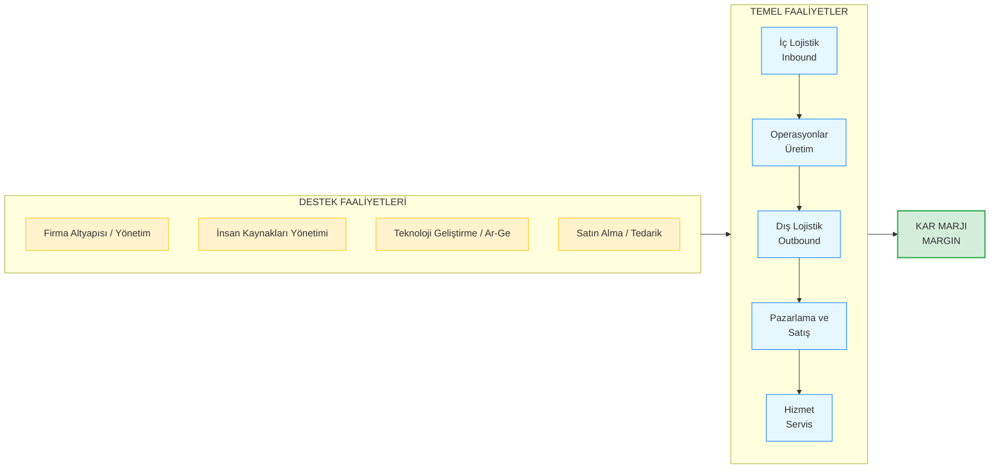

# Porter'ın Değer Zinciri Analizi

**Kategori:** Stratejik Analiz ve Operasyonel Verimlilik (İçsel Analiz)

## 1. Yönetici Özeti (TL;DR)
Değer Zinciri Analizi; bir ürünün veya hizmetin hammaddeden başlayıp müşteriye ulaşana (ve sonrasındaki destek sürecine) kadar geçen tüm adımlarını inceleyen bir modeldir. 

* **Amaç:** Şirket içindeki hangi faaliyetlerin müşterinin gözünde "değer" yarattığını ve hangi faaliyetlerin sadece "maliyet" kalemi olduğunu tespit etmek.
* **Felsefe:** Kâr marjı (Margin) = Yaratılan Toplam Değer - Bu değeri yaratmak için katlanılan Toplam Maliyet.
* **Kullanım Alanı:** Operasyonel verimliliği artırmak, maliyetleri düşürmek veya ürünü farklılaştırarak rekabet avantajı sağlamak istendiğinde.

---

## 2. Kökeni ve Tarihçesi
* **Ortaya Çıkış:** 1985.
* **Yaratıcısı:** Harvard Business School profesörü **Michael E. Porter** (5 Güç Analizinin de yaratıcısı).
* **Kaynak:** "Competitive Advantage: Creating and Sustaining Superior Performance" adlı kitabı.
* **Katkısı:** Şirketleri sadece "departmanlardan" oluşan yapılar olarak değil, birbirine bağlı "değer yaratan süreçler" bütünü olarak tanımlamıştır.

---

## 3. Modelin Temel Yapısı (Temel ve Destek Faaliyetler)

Porter, şirket faaliyetlerini iki ana gruba ayırır. Bu faaliyetlerin mükemmel uyumu, günün sonunda şirketin **Kâr Marjını** oluşturur.

[Image of Porter's Value Chain model diagram]

### 📋 Detaylı Açıklama

**A. Temel Faaliyetler (Ürüne Doğrudan Dokunanlar):**
1. **İç Lojistik (Inbound Logistics):** Hammaddelerin tesise gelmesi, depolanması ve üretime dağıtılması.
2. **Operasyonlar (Operations):** Hammaddenin nihai ürüne dönüştürüldüğü üretim/kodlama aşaması.
3. **Dış Lojistik (Outbound Logistics):** Bitmiş ürünün depolanması ve müşteriye ulaştırılması.
4. **Pazarlama ve Satış:** Müşterinin ürünü alması için ikna edilmesi, fiyatlandırma, reklam.
5. **Hizmet (Service):** Satış sonrası kurulum, eğitim, onarım ve garanti hizmetleri.

**B. Destek Faaliyetleri (Arka Planda Sistemi Ayakta Tutanlar):**
1. **Firma Altyapısı:** Genel yönetim, finans, muhasebe, hukuki işler.
2. **İnsan Kaynakları:** İşe alım, eğitim, motivasyon ve ödüllendirme.
3. **Teknoloji Geliştirme:** Ar-Ge, ürün tasarımı, süreçleri hızlandıran iç yazılımlar.
4. **Satın Alma:** Temel faaliyetler için gereken makine, ekipman ve hammaddenin piyasa araştırması yapılıp alınması.

---

## 4. Uygulama Adımları

1. **Faaliyetleri Haritalandırın:** Şirketinizdeki tüm iş süreçlerini yukarıdaki 9 kutuya yerleştirin.
2. **Değer ve Maliyet Analizi Yapın:** Her bir adım müşterinin ödemeye razı olduğu fiyata ne katıyor? Bize maliyeti ne?
3. **Bağlantıları (Linkages) İnceleyin:** Bir adımdaki hata diğerini nasıl etkiliyor? (Örn: "Satın Alma" ucuz ama kalitesiz malzeme alırsa, "Hizmet" biriminin arıza/garanti maliyetleri patlar).
4. **Optimizasyon:** Rakiplerden daha iyi yaptığınız yerlere yatırım yapın, sırf maliyet üreten ve değer katmayan adımları dışarıdan hizmet (Outsource) olarak alın.

---

## 5. Kritik Sorular

* Müşteri bizim ürünümüze neden para ödüyor? Kusursuz "Operasyon" için mi, yoksa harika "Satış Sonrası Hizmet" için mi?
* En çok parayı (maliyet) zincirin hangi halkasında harcıyoruz? Bu harcama müşterinin umurunda mı?
* "İnsan Kaynakları" veya "Firma Altyapısı" gibi destek birimlerimiz, temel üretim sürecini gerçekten hızlandırıyor mu, yoksa bürokrasi mi yaratıyor?

---

## 6. Avantajlar ve Kısıtlar

### ✅ Avantajları
* **Maliyet Kontrolü:** Paranın tam olarak nerede "yakıldığını" net bir şekilde gösterir.
* **Farklılaşma Noktaları:** Rakibin zayıf olduğu bir halkayı bularak (Örn: Rakibin satış sonrası servisi kötüyse) oradan rekabet avantajı sağlamaya yardımcı olur.
* **Süreç Bütünlüğü:** Departmanların birbirinden bağımsız silolar olmadığını kanıtlar.

### ⚠️ Kısıtları
* **Veri İhtiyacı:** Her bir adımın tam maliyetini hesaplamak ciddi bir muhasebe altyapısı ve zaman gerektirir.
* **Hizmet Sektörüne Uyumu:** Orijinal model fiziksel "üretim" (fabrika) odaklıdır. Yazılım veya danışmanlık gibi hizmet sektörlerine uyarlamak biraz esneklik gerektirir.

---

## 7. Örnek Senaryo: "CodeBrew" (Süreç Optimizasyonu)

**Senaryo:** CodeBrew, endüstriyel gömülü sistemler ve donanım tasarımları yapıyor. Şirketin hangi adımlarda katma değer yarattığına bakalım:

| Zincir Halkası | CodeBrew'daki Karşılığı | Durum Değerlendirmesi |
| :--- | :--- | :--- |
| **İç Lojistik** | Çin'den veya distribütörlerden ESP32 çiplerin ve DWIN ekranların sorunsuz ithalatı. | Kritik değil, standart bir süreç. |
| **Operasyonlar** | Altium'da PCB tasarımı yapmak ve donanım için C/C++ kodlarını (iş mantığını) yazmak. | **YÜKSEK DEĞER:** Şirketin kalbi burası. Kod kalitesi ve tasarım uzmanlığı. |
| **Dış Lojistik** | Tamamlanan endüstriyel panellerin fabrikalara güvenli nakliyesi. | Standart kurye / nakliye işi. |
| **Pazarlama/Satış** | Upwork üzerinden global müşterilere teklif hazırlamak, LinkedIn'de sektörel içerik üretmek ve GitHub'da açık kaynak repo'lar paylaşmak. | **YÜKSEK DEĞER:** Global network ve mühendislik itibarının inşa edildiği yer. |
| **Hizmet (Servis)** | Satış sonrası sahadaki cihazlara uzaktan güncelleme çıkmak ve bakım yapmak. | Müşteriyi elde tutmak için kritik (Recurring revenue). |
| **Teknoloji Geliştirme (Destek)** | Evrensel bir DWIN HMI kütüphanesi yazıp şirket içi projelerde kullanımını standartlaştırmak. | **KALDIRAÇ:** Operasyonlar adımındaki "kod yazma" süresini yarı yarıya düşürür. |

**Sonuç:** CodeBrew'un müşteriye asıl değer kattığı yer **Operasyonlar** ve güçlü **Pazarlama (Network)** adımlarıdır. Lojistik gibi adımlar ise sadece maliyettir ve asgari düzeyde tutulmalı veya dışarıya (outsource) verilmelidir. Aynı zamanda şirket içi *Teknoloji Geliştirmeye* yatırım yapmak, ana operasyonu inanılmaz hızlandıracaktır.

---
🔙 [Ana Sayfaya Dön](../../README.tr.md)