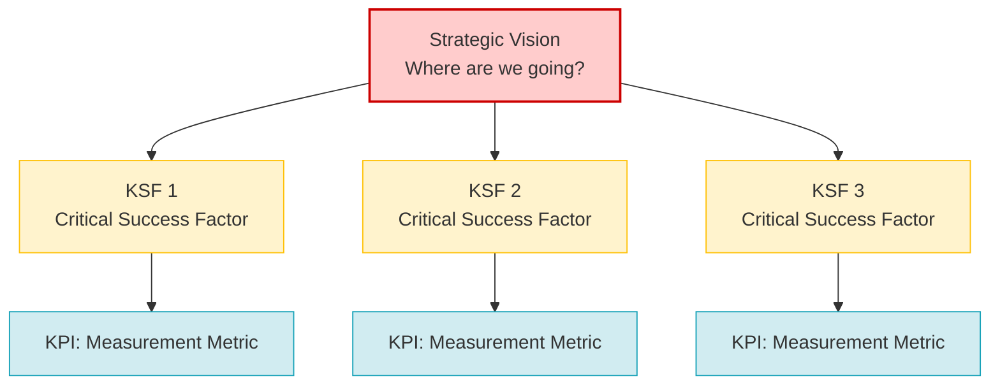

# Key Success Factors (KSF / CSF Analysis)

**Category:** Strategic Analysis and Goal Setting

## 1. Executive Summary (TL;DR)
Key Success Factors (KSFs) or Critical Success Factors (CSFs) are 3 to 5 critical areas that a business **must execute flawlessly** to survive and gain a competitive advantage in its industry.

* **Purpose:** To focus the company's limited time, energy, and budget on "must-have" areas.
* **Philosophy:** You cannot do everything perfectly. If you don't do *this* perfectly, you will fail.
* **Use Case:** When setting strategic goals and just before defining operational priorities (KPIs).

---

## 2. Origin and History
* **Emergence:** 1961.
* **Creator:** The foundation of the idea was laid by McKinsey consultant **D. Ronald Daniel**, and it was popularized in its current "Critical Success Factors" structure by MIT professor **John F. Rockart** in 1979.
* **Need:** Developed to prevent managers from drowning under data bombardment and to answer the question, "Which data should I really focus on?"

---

## 3. Basic Structure of the Model (Strategy - KSF - KPI Relationship)

KSF is the bridge between broad strategy and numerical measurements (KPIs).

### 📋 Sources of KSFs (According to Rockart)
Rockart states that KSFs stem from 4 main sources:

| Source | Explanation and Example |
| :--- | :--- |
| **1. Industry KSFs** | Rules everyone in that industry must follow. *(e.g., Flight safety for the aviation industry).* |
| **2. Environmental KSFs** | External pressures coming from PESTEL analysis. *(e.g., Compliance with emission rules for automotive).* |
| **3. Strategic KSFs** | Those arising from the company's own competitive strategy. *(e.g., If you have a "discount supermarket" strategy, the KSF is a flawless supply chain).* |
| **4. Temporal KSFs** | Short-term factors that emerge during crises. *(e.g., During a cash bottleneck, the KSF is urgent cash flow management).* |

---

## 4. Implementation Steps

1.  **Industry Analysis (What does the customer want?):** What are the top 2 reasons customers choose you over a competitor? (Is it price, quality, or speed?)
2.  **Competitive Analysis (How do we survive?):** What is the biggest risk in this industry that inflates costs or drives customers away?
3.  **Filtering:** Ruthlessly eliminate the 20 ideas that come out of brainstorming. Reduce the number to a **maximum of 3-5**. (If you have 10 KSFs, you are actually focusing on nothing).
4.  **Converting to Metrics (KPIs):** KSF is the goal, KPI is the measurement of that goal.
    * *KSF:* Excellent Customer Service.
    * *KPI:* Time to answer the phone in the call center (< 15 seconds).

---

## 5. Critical Questions

* If our company's budget was cut in half tomorrow, which 3 departments or processes must we absolutely protect?
* What is the "one thing" that our competitors cannot do, which if we do, we will dominate the market?
* In which area, if we mess up, will we bankrupt the company even if we do everything else perfectly?

---

## 6. Advantages and Constraints

### ✅ Advantages
* **Laser Focus:** Ensures everyone in the company (from CEO to intern) knows what is truly important.
* **Resource Optimization:** Allows you to invest money and time directly into KSFs, not side projects that do not bring results.
* **Simplification:** Turns complex strategic plans into an understandable 3-4 point language.

### ⚠️ Constraints
* **Confusion with KPIs:** Managers often confuse KSF (What must we achieve?) with KPI (How do we measure it?).
* **Blind Devotion:** Sticking to old KSFs when the environment changes (e.g., when a new technology emerges) can blind the company.

---

## 7. Example Scenario: "CodeBrew" (Determining KSFs)

**Scenario:** CodeBrew develops industrial embedded systems and IoT projects. The industry does not forgive mistakes; if factories stop, it causes millions of dollars in damage. What are CodeBrew's KSFs (Must-Haves) to survive and grow?

| KSF (Critical Success Factor) | Why is it Critical? | Linked KPI (How will it be measured?) |
| :--- | :--- | :--- |
| **1. Industrial Reliability (Zero-Bug)** | If the device crashes in the field, the customer will never work with CodeBrew again. "Fast but buggy" code is a reason for bankruptcy in this sector. | Number of critical bugs reported in the field (Target: 0). |
| **2. Rapid Prototyping and Hardware Sourcing** | Customers want to physically see that the idea works on the table. Coordinating hardware production quickly is essential. | Time to move from initial concept (PoC) to a working prototype (Target: < 4 weeks). |
| **3. Retaining Qualified Talent** | Finding a C/C++ engineer who can understand both hardware and software at the same time is very difficult. If the team falls apart, projects stop. | Annual turnover rate of key personnel (Target: < 5%). |

**Conclusion:** Instead of allocating massive budgets to marketing, office decoration, or social media, CodeBrew should focus all its power on perfecting its **code testing processes (Test-Driven Development)** and **keeping its engineers happy**. This is its KSF.

---
🔙 [Back to Home](../../README.md)