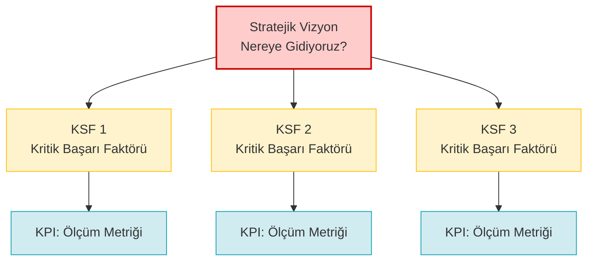

# Anahtar Başarı Faktörleri (KSF / CSF Analizi)

**Kategori:** Stratejik Analiz ve Hedef Belirleme

## 1. Yönetici Özeti (TL;DR)
Anahtar Başarı Faktörleri (Key Success Factors) veya Kritik Başarı Faktörleri (Critical Success Factors); bir işletmenin bulunduğu sektörde hayatta kalabilmesi ve rekabet avantajı sağlayabilmesi için **mükemmel seviyede yapması zorunlu olan** 3 ila 5 kritik alandır. 

* **Amaç:** Şirketin sınırlı zaman, enerji ve bütçesini "olmazsa olmaz" konulara odaklamak.
* **Felsefe:** Her şeyi mükemmel yapamazsınız. Neyi mükemmel yapmazsanız batarsınız?
* **Kullanım Alanı:** Stratejik hedefleri belirlerken ve operasyonel öncelikleri (KPI'ları) tanımlamadan hemen önce.

---

## 2. Kökeni ve Tarihçesi
* **Ortaya Çıkış:** 1961.
* **Yaratıcısı:** McKinsey danışmanı **D. Ronald Daniel** tarafından fikrin temelleri atılmış, 1979'da MIT profesörü **John F. Rockart** tarafından bugünkü "Kritik Başarı Faktörleri" yapısıyla popülerleştirilmiştir.
* **İhtiyaç:** Yöneticilerin veri bombardımanı altında boğulmasını engellemek ve "Hangi verilere gerçekten odaklanmalıyım?" sorusunu cevaplamak için geliştirilmiştir.

---

## 3. Modelin Temel Yapısı (Strateji - KSF - KPI İlişkisi)

KSF, geniş strateji ile rakamsal ölçümler (KPI) arasındaki köprüdür.

### 📋 KSF Kaynakları (Rockart'a Göre)
Rockart, KSF'lerin 4 ana yerden beslendiğini söyler:

| Kaynak | Açıklama ve Örnek |
| :--- | :--- |
| **1. Sektörel KSF** | O sektörde olan herkesin uyması gereken kurallar. *(Örn: Havacılık sektörü için uçuş güvenliği).* |
| **2. Çevresel KSF** | PESTEL analizi ile gelen dış baskılar. *(Örn: Otomotiv için emisyon kurallarına uyum).* |
| **3. Stratejik KSF** | Firmanın kendi rekabet stratejisinden doğanlar. *(Örn: "Ucuz market" stratejiniz varsa KSF: Kusursuz tedarik zinciridir).* |
| **4. Geçici KSF** | Kriz anlarında ortaya çıkan kısa vadeli faktörler. *(Örn: Nakit darboğazında KSF: Acil nakit akışı yönetimidir).* |

---

## 4. Uygulama Adımları

1.  **Sektör Analizi (Müşteri Ne İstiyor?):** Müşterilerin rakibi değil sizi seçmesi için en önemli 2 neden nedir? (Fiyat mı, kalite mi, hız mı?)
2.  **Rekabet Analizi (Nasıl Hayatta Kalırız?):** Bu sektörde maliyetleri şişiren veya müşteriyi kaçıran en büyük risk nedir?
3.  **Filtreleme:** Beyin fırtınasıyla çıkan 20 fikri acımasızca eleyin. Sayıyı **maksimum 3-5 arasına** indirin. (Eğer 10 tane KSF'niz varsa, aslında hiçbir şeye odaklanmıyorsunuz demektir).
4.  **Metriğe (KPI) Çevirme:** KSF hedeftir, KPI o hedefin ölçümüdür.
    * *KSF:* Mükemmel Müşteri Hizmetleri.
    * *KPI:* Çağrı merkezinde telefona cevap verme süresi (< 15 saniye).

---

## 5. Kritik Sorular

* Yarın şirketimizin bütçesi yarı yarıya kesilse, hangi 3 departmanı veya süreci kesinlikle korumamız gerekir?
* Rakiplerimizin yapamadığı, bizim yaparsak pazarı domine edeceğimiz o "tek şey" nedir?
* Hangi alanda çuvallarsak, diğer her şeyi mükemmel yapsak bile şirketi batırırız?

---

## 6. Avantajlar ve Kısıtlar

### ✅ Avantajları
* **Lazer Odaklılık:** Şirketteki herkesin (CEO'dan stajyere) neyin gerçekten önemli olduğunu bilmesini sağlar.
* **Kaynak Optimizasyonu:** Parayı ve zamanı, sonuç getirmeyen yan projelere değil, doğrudan KSF'lere yatırmanızı sağlar.
* **Sadeleşme:** Karmaşık stratejik planları 3-4 maddelik anlaşılır bir dil haline getirir.

### ⚠️ Kısıtları
* **KPI ile Karıştırılması:** Yöneticiler sık sık KSF (Neyi başarmalıyız?) ile KPI'yi (Bunu nasıl ölçeriz?) birbirine karıştırır.
* **Körü Körüne Bağlılık:** Ortam değiştiğinde (Örn: Yeni bir teknoloji çıktığında) eski KSF'lere saplanıp kalmak şirketi kör edebilir.

---

## 7. Örnek Senaryo: "CodeBrew" (KSF Belirleme)

**Senaryo:** CodeBrew, endüstriyel gömülü sistemler ve IoT projeleri yapıyor. Sektör hata affetmiyor, fabrikalar durursa milyonlarca lira zarar yazıyor. CodeBrew'un hayatta kalmak ve büyümek için KSF'leri (Olmazsa Olmazları) nelerdir?

| KSF (Kritik Başarı Faktörü) | Neden Kritik? | Bağlı KPI (Nasıl Ölçülecek?) |
| :--- | :--- | :--- |
| **1. Endüstriyel Güvenilirlik (Zero-Bug)** | Sahadaki cihaz çökerse müşteri bir daha CodeBrew ile çalışmaz. "Hızlı ama hatalı" kod bu sektörde iflas sebebidir. | Sahada bildirilen kritik hata (bug) sayısı (Hedef: 0). |
| **2. Hızlı Prototipleme ve Donanım Tedariği** | Müşteriler fikrin çalıştığını fiziksel olarak masada görmek ister. Donanım üretimini hızlı koordine etmek şarttır. | İlk konseptten (PoC) çalışır prototipe geçiş süresi (Hedef: < 4 hafta). |
| **3. Nitelikli Yeteneği Elde Tutma** | Donanım ve yazılımı aynı anda anlayabilen C/C++ mühendisi bulmak çok zordur. Ekip dağılırsa projeler durur. | Anahtar personelin yıllık işten ayrılma oranı (Hedef: < %5). |

**Sonuç:** CodeBrew pazarlamaya, ofis dekorasyonuna veya sosyal medyaya devasa bütçeler ayırmak yerine; tüm gücünü **kod test süreçlerini (Test-Driven Development)** mükemmelleştirmeye ve **mühendislerini mutlu etmeye** odaklamalıdır. KSF budur.

---
🔙 [Ana Sayfaya Dön](../../README.tr.md)