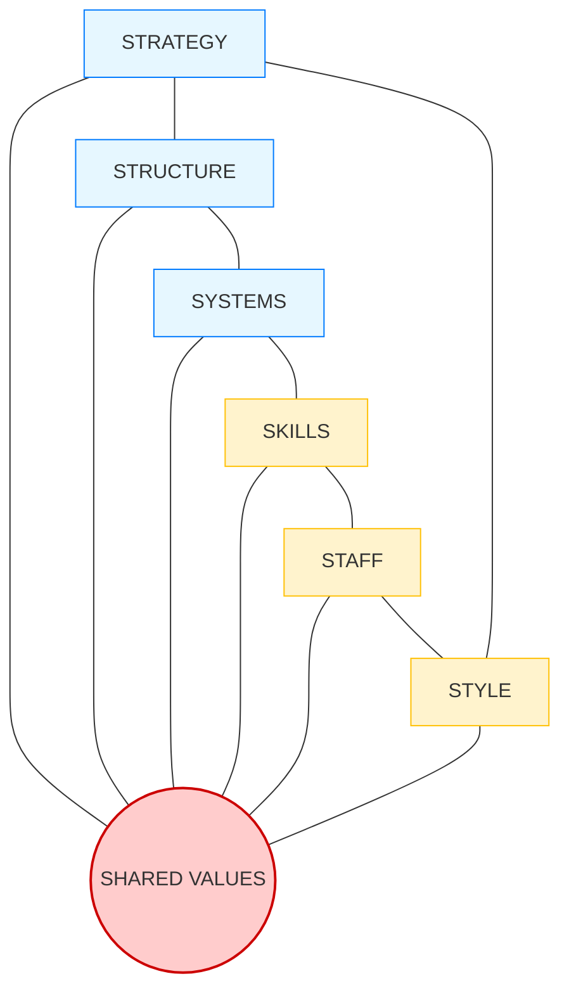

# McKinsey 7S Model

**Category:** Organizational Analysis and Change Management

## 1. Executive Summary (TL;DR)
The McKinsey 7S Model analyzes 7 internal elements that must be aligned for an organization to operate effectively. The model argues that success depends not only on "Strategy" but also on corporate culture, human resources, and systems.

* **Hard S's:** Tangible elements that management can easily identify and change (Strategy, Structure, Systems).
* **Soft S's:** Intangible elements based on culture, which are harder to change (Shared Values, Style, Staff, Skills).
* **Purpose:** To detect organizational misalignments (e.g., "Our strategy is innovative, but our structure is bureaucratic").

---

## 2. Origin and History
* **Emergence:** Early 1980s.
* **Creators:** McKinsey consultants **Tom Peters** and **Robert Waterman** (Authors of the famous book "In Search of Excellence").
* **Idea:** At that time, companies focused only on "Structure" and "Strategy". The authors proved that "People" and "Culture" factors must also be included in the equation.

---

## 3. Basic Structure of the Model (Spider Web)

"Shared Values" are at the heart of the model and connect all other elements.

### 📋 Detailed Explanation

#### A. Hard Elements (Easier to Manage)
| Element | Definition |
| :--- | :--- |
| **1. Strategy** | The plan devised to gain competitive advantage. (Porter etc. is used here). |
| **2. Structure** | The organizational chart. Who reports to whom? (Hierarchical, Matrix, Agile). |
| **3. Systems** | Daily procedures and tools that make the business run (Accounting software, CRM, HR processes). |

#### B. Soft Elements (Culture-Based)
| Element | Definition |
| :--- | :--- |
| **4. Shared Values** | The company's reason for existence, vision, and core beliefs. It is at the center of everything. |
| **5. Style** | Leadership style and company culture. (Do managers work with open doors, or are they formal?). |
| **6. Staff** | The general status, motivation, and demographics of employees. |
| **7. Skills** | What the organization (not individuals) does really well collectively. |

---

## 4. Implementation Steps

1.  **Analyze Current State:** Review the 7 items one by one. Find the gaps.
2.  **Detect Misalignments:**
    * *Our strategy is built on "Speed", but are our Systems slow due to an "Approval Mechanism"?*
    * *Our structure says "Teamwork", but does our Reward System praise "Individual Success"?*
3.  **Design Ideal State:** How should these 7 items be in the future?
4.  **Plan Change:** Changing Soft S's can take years, be patient.

---

## 5. Critical Questions

* **Structure vs Strategy:** Does our organizational chart serve our strategy or hinder it?
* **Systems:** Do the software tools we use support employees or just control them?
* **Staff:** Do we have the right people to execute the strategy?
* **Values:** Is "Customer Centricity" just an ornament on the wall, or is it really practiced?

---

## 6. Advantages and Constraints

### ✅ Advantages
* **Holistic Approach:** Focuses not only on processes but also on the human factor.
* **Alignment:** Clearly shows whether departments are running towards the same goal.
* **Change Management:** Shows culture clashes in advance during Mergers and Acquisitions (M&A).

### ⚠️ Constraints
* **Complexity:** It is difficult to analyze and manage 7 variables simultaneously.
* **Time-Consuming:** Changing soft elements (Culture) takes a very long time, not suitable for urgent crisis management.
* **No External Environment:** The model is completely internal-focused, it does not cover external competition (Porter/PESTEL).

---

## 7. Example Scenario: "CodeBrew" (Growing Pains)

**Scenario:** CodeBrew grew from 10 to 50 people. Strategy is "Innovative IoT Solutions", but things have slowed down.

| 7S Element | Current Status | Problem / Misalignment |
| :--- | :--- | :--- |
| **Strategy** | Making fast, flexible, and innovative IoT projects. | ✅ Strategy is clear. |
| **Structure** | Founder approves everything (Overly Centralized). | ❌ **MISALIGNMENT:** Strategy wants "Speed", Structure "Slows Down". |
| **Systems** | Projects are tracked via Excel and WhatsApp. | ❌ **MISALIGNMENT:** Insufficient for 50 people, error rate is increasing. |
| **Shared Values** | "Engineering Excellence". | ✅ Everyone loves writing quality code. |
| **Style** | "We are a family" culture. | ⚠️ As it grows, this culture is turning into a "lack of professionalism". |
| **Staff** | Young and talented engineers. | ✅ Staff is suitable. |
| **Skills** | Great at embedded software, weak at Project Management. | ❌ **GAP:** Technical skill exists, management skill is missing. |

**Solution:** To fit its strategy (Speed), CodeBrew must change its **Structure** (appoint Team Leaders) and update its **Systems** (switch to Jira, etc.).

---
🔙 [Back to Home](../../README.md)