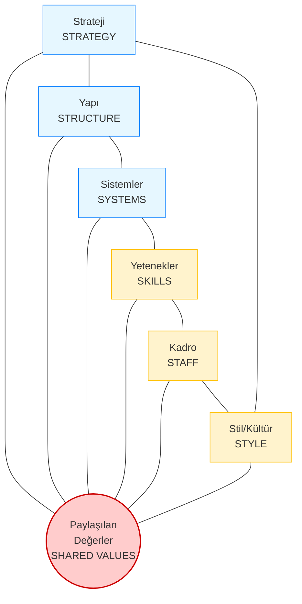

# McKinsey 7S Modeli

**Kategori:** Organizasyonel Analiz ve Değişim Yönetimi

## 1. Yönetici Özeti (TL;DR)
McKinsey 7S Modeli; bir organizasyonun etkili bir şekilde çalışabilmesi için birbiriyle uyumlu olması gereken 7 içsel unsuru analiz eder. Model, başarının sadece "Strateji"ye değil, aynı zamanda kurum kültürüne, insan kaynağına ve sistemlere bağlı olduğunu savunur.

* **Hard (Sert) S'ler:** Yönetimin kolayca tanımlayıp değiştirebileceği somut unsurlar (Strateji, Yapı, Sistemler).
* **Soft (Yumuşak) S'ler:** Değişmesi zor, kültüre dayalı soyut unsurlar (Paylaşılan Değerler, Stil, Kadro, Yetenekler).
* **Amaç:** Organizasyonel uyumsuzlukları tespit etmek (Örn: "Stratejimiz yenilikçi ama yapımız bürokratik").

---

## 2. Kökeni ve Tarihçesi
* **Ortaya Çıkış:** 1980'lerin başı.
* **Yaratıcıları:** McKinsey danışmanları **Tom Peters** ve **Robert Waterman** (Ünlü "In Search of Excellence" kitabının yazarları).
* **Fikir:** O dönemde şirketler sadece "Yapı" ve "Strateji"ye odaklanıyordu. Yazarlar, "İnsan" ve "Kültür" faktörlerinin de denkleme girmesi gerektiğini kanıtladı.

---

## 3. Modelin Temel Yapısı (Örümcek Ağı)

Modelin kalbinde "Paylaşılan Değerler" yer alır ve tüm diğer elemanları birbirine bağlar.

### 📋 Detaylı Açıklama

#### A. Sert (Hard) Unsurlar (Kolay Yönetilir)
| Unsur | Tanım |
| :--- | :--- |
| **1. Strateji (Strategy)** | Rekabet avantajı elde etmek için yapılan plan. (Burada Porter vb. kullanılır). |
| **2. Yapı (Structure)** | Organizasyon şeması. Kim kime rapor veriyor? (Hiyerarşik, Matris, Agile). |
| **3. Sistemler (Systems)** | İşin yürümesini sağlayan günlük prosedürler ve araçlar (Muhasebe yazılımı, CRM, İK süreçleri). |

#### B. Yumuşak (Soft) Unsurlar (Kültüre Dayalı)
| Unsur | Tanım |
| :--- | :--- |
| **4. Paylaşılan Değerler (Shared Values)** | Şirketin varoluş amacı, vizyonu ve temel inançları. Her şeyin merkezindedir. |
| **5. Stil (Style)** | Liderlik tarzı ve şirket kültürü. (Yöneticiler kapısı açık mı çalışır, resmi mi?). |
| **6. Kadro (Staff)** | Çalışanların genel durumu, motivasyonu ve demografik yapısı. |
| **7. Yetenekler (Skills)** | Organizasyonun (bireylerin değil) kolektif olarak "neyi çok iyi yaptığı". |

---

## 4. Uygulama Adımları

1.  **Mevcut Durumu Analiz Et:** 7 maddeyi tek tek gözden geçir. Boşlukları bul.
2.  **Uyumsuzlukları Tespit Et:**
    * *Stratejimiz "Hız" üzerine kurulu ama Sistemlerimiz "Onay Mekanizması" yüzünden yavaş mı?*
    * *Yapımız "Takım Çalışması" diyor ama Ödül Sistemimiz "Bireysel Başarıyı" mı övüyor?*
3.  **İdeal Durumu Tasarla:** Gelecekte bu 7 madde nasıl olmalı?
4.  **Değişim Planı Yap:** Yumuşak S'leri değiştirmek yıllar alabilir, sabırlı olun.

---

## 5. Kritik Sorular

* **Yapı vs Strateji:** Organizasyon şemamız stratejimize hizmet ediyor mu yoksa engel mi oluyor?
* **Sistemler:** Kullandığımız yazılımlar çalışanları destekliyor mu yoksa sadece kontrol mü ediyor?
* **Kadro:** Stratejiyi hayata geçirecek doğru insanlara sahip miyiz?
* **Değerler:** "Müşteri Odaklılık" sadece duvarda yazılı bir süs mü, yoksa gerçekten uygulanıyor mu?

---

## 6. Avantajlar ve Kısıtlar

### ✅ Avantajları
* **Bütüncül Yaklaşım:** Sadece süreçlere değil, insan faktörüne de odaklanır.
* **Hizalama (Alignment):** Departmanların aynı hedefe koşup koşmadığını net gösterir.
* **Değişim Yönetimi:** Birleşme ve satın almalarda (M&A) kültür çatışmasını önceden gösterir.

### ⚠️ Kısıtları
* **Karmaşıklık:** 7 değişkeni aynı anda analiz etmek ve yönetmek zordur.
* **Zaman Alıcı:** Yumuşak unsurları (Kültür) değiştirmek çok uzun sürer, acil kriz yönetimine uygun değildir.
* **Dış Çevre Yok:** Model tamamen içe dönüktür, dışarıdaki rekabeti (Porter/PESTEL) kapsamaz.

---

## 7. Örnek Senaryo: "CodeBrew" (Büyüme Sancıları)

**Senaryo:** CodeBrew 10 kişiden 50 kişiye çıktı. Strateji "Yenilikçi IoT Çözümleri" ama işler yavaşladı.

| 7S Unsuru | Mevcut Durum | Sorun / Uyumsuzluk |
| :--- | :--- | :--- |
| **Strateji** | Hızlı, esnek ve yenilikçi IoT projeleri yapmak. | ✅ Strateji net. |
| **Yapı** | Kurucu her şeye onay veriyor (Aşırı Merkeziyetçi). | ❌ **UYUMSUZLUK:** Strateji "Hız" istiyor, Yapı "Yavaşlatıyor". |
| **Sistemler** | Projeler Excel ve WhatsApp üzerinden takip ediliyor. | ❌ **UYUMSUZLUK:** 50 kişi için bu sistem yetersiz, hata oranı artıyor. |
| **Paylaşılan Değerler** | "Mühendislik Mükemmelliği". | ✅ Herkes kaliteli kod yazmayı seviyor. |
| **Stil** | "Biz bir aileyiz" kültürü. | ⚠️ Büyüyünce bu kültür "profesyonellik eksikliğine" dönüşmeye başladı. |
| **Kadro** | Genç ve yetenekli mühendisler. | ✅ Kadro uygun. |
| **Yetenekler** | Gömülü yazılımda süperiz ama Proje Yönetiminde zayıfız. | ❌ **EKSİKLİK:** Teknik yetenek var, yönetim yeteneği yok. |

**Çözüm:** CodeBrew, stratejisine (Hız) uygun olması için **Yapı'yı** değiştirmeli (Takım Liderleri atamalı) ve **Sistemler'i** güncellemeli (Jira vb. geçmeli).

---
🔙 [Ana Sayfaya Dön](../../README.tr.md)