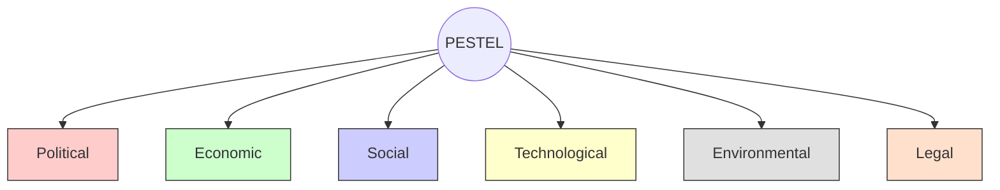

# PEST / PESTEL Analysis

**Category:** Strategic Analysis and Environmental Scanning

## 1. Executive Summary (TL;DR)
PESTEL Analysis is a framework that examines the **Macro-Environmental** factors (the big picture) that can affect an organization. It maps the external world that the company cannot control but must adapt to.

* **Acronym:** **P**olitical, **E**conomic, **S**ocial, **T**echnological, **E**nvironmental, **L**egal.
* **Purpose:** To identify market growth or decline potential, external risks, and future directions.
* **Use Cases:** When entering a new country/market, during product launches, and in the initial phase of strategic planning.

---

## 2. Origin and History
* **Emergence:** 1967.
* **Origin:** Based on the **ETPS** (Economic, Technical, Political, Social) model introduced by Harvard professor **Francis Aguilar** in his book "Scanning the Business Environment".
* **Evolution:** Over time, with increasing environmental awareness and stricter regulations, "Environmental" and "Legal" factors were added, evolving into today's **PESTEL** model.

---

## 3. Basic Structure of the Model (6 Factors)

PESTEL examines 6 main external forces surrounding the organization.

### 📋 Detailed Explanation

| Factor | Focus Question | Content and Examples |
| :--- | :--- | :--- |
| **P - Political** | *To what extent does the government intervene in the market?* | Tax policies, incentives, trade restrictions, political stability, election cycles. |
| **E - Economic** | *What are the monetary factors affecting our pockets?* | Inflation, interest rates, exchange rates, unemployment rates, economic growth rate, disposable income. |
| **S - Social** | *What are the habits and demographics of the society?* | Population growth rate, age distribution, career attitudes, lifestyle changes, cultural norms. |
| **T - Technological** | *Which innovations can disrupt or grow our business?* | Automation, R&D incentives, AI, internet infrastructure, intellectual property technologies. |
| **E - Environmental** | *How do the planet and climate limit us?* | Carbon footprint targets, climate change, waste management laws, sustainability trends. |
| **L - Legal** | *Which rules must we comply with?* | Labor law, consumer rights, GDPR (Data security), health and safety regulations. |

---

## 4. Implementation Steps

1.  **Brainstorming:** Gather experts from relevant departments (e.g., lawyers for Legal, finance team for Economic).
2.  **Listing Factors:** Write down the items affecting your company for each heading (P, E, S, T, E, L).
3.  **Impact Analysis:** Score the impact of each item (e.g., 1-5).
    * *If this event happens, how much will it shake us?*
    * *What is the probability of occurrence?*
4.  **Transfer to SWOT:**
    * Move positive items to the **Opportunities (O)** box of the SWOT analysis.
    * Move negative items to the **Threats (T)** box.

---

## 5. Critical Questions

* **Political:** Will an upcoming election or regulation change undermine our business model?
* **Economic:** How much does a 10% increase in exchange rates affect our costs?
* **Social:** Does Gen Z find our product "old-fashioned"? Are we ready for remote work culture?
* **Technological:** Have our competitors automated a job we do manually using AI?

---

## 6. Advantages and Constraints

### ✅ Advantages
* **Early Warning System:** Allows you to see threats before they arrive.
* **External Focus:** Breaks business blindness, forces managers to look outside the office.
* **Opportunity Detection:** Ideal for discovering new markets.

### ⚠️ Constraints
* **Too Dynamic:** The external world changes very fast (like a decree issued overnight), the analysis can become outdated quickly.
* **Data Overload:** Collecting too much information can create "analysis paralysis". Focus only on data that affects your business.

---

## 7. Example Scenario: "CodeBrew" (Continuing Example)

**Scenario:** External environment analysis of CodeBrew, an Ankara-based embedded systems software office.

| Factor | Observation | Comment (Opportunity or Threat?) |
| :--- | :--- | :--- |
| **Political** | Increasing localization incentives in the defense industry. | **Opportunity:** High chance of getting a share from public projects. |
| **Economic** | High inflation and rising personnel salary expectations. | **Threat:** Costs are increasing, cash flow may be strained. |
| **Social** | Brain drain tendency among engineers. | **Threat:** Finding and retaining qualified staff is becoming difficult. |
| **Technological** | AI (Copilot, etc.) increases coding speed. | **Opportunity:** Team efficiency can be increased. |
| **Environmental** | Energy efficiency requirement within the scope of EU Green Deal. | **Neutral/Opportunity:** Energy-efficient IoT devices can be designed for export. |
| **Legal** | Remote work regulations and GDPR updates. | **Threat:** Legal compliance costs and administrative workload will increase. |

---
🔙 [Back to Home](../../README.md)