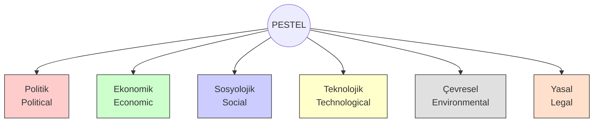

# PEST / PESTEL Analizi

**Kategori:** Stratejik Analiz ve Durum Değerlendirme

## 1. Yönetici Özeti (TL;DR)
PESTEL Analizi; bir organizasyonu etkileyebilecek **Makro-Çevresel** faktörlerin (büyük resmin) incelendiği bir çerçevedir. Şirketin kontrol edemediği ancak uyum sağlamak zorunda olduğu dış dünyayı haritalandırır.

* **Açılımı:** **P**olitical, **E**conomic, **S**ocial, **T**echnological, **E**nvironmental, **L**egal.
* **Amaç:** Pazarın büyüme veya küçülme potansiyelini, dış riskleri ve yönelimleri tespit etmek.
* **Kullanım Alanı:** Yeni bir ülkeye/pazara girerken, ürün lansmanlarında ve stratejik planlamanın ilk aşamasında.

---

## 2. Kökeni ve Tarihçesi
* **Ortaya Çıkış:** 1967.
* **Köken:** Harvard profesörü **Francis Aguilar**'ın "Scanning the Business Environment" adlı kitabında tanıttığı **ETPS** (Economic, Technical, Political, Social) modeline dayanır.
* **Evrim:** Zamanla çevre bilincinin artması ve yasal düzenlemelerin sıkılaşmasıyla, orijinal modele "Environmental" ve "Legal" maddeleri eklenerek bugünkü **PESTEL** halini almıştır.

---

## 3. Modelin Temel Yapısı (6 Faktör)

PESTEL, organizasyonu çevreleyen 6 ana dış kuvveti inceler.

### 📋 Detaylı Açıklama

| Faktör | Odak Sorusu | İçerik ve Örnekler |
| :--- | :--- | :--- |
| **P - Politik** | *Devletin piyasaya müdahalesi ne boyutta?* | Vergi politikaları, teşvikler, dış ticaret kısıtlamaları, siyasi istikrar, seçim dönemleri. |
| **E - Ekonomik** | *Cebimizi etkileyen parasal faktörler neler?* | Enflasyon, faiz oranları, döviz kurları, işsizlik oranları, ekonomik büyüme hızı, harcanabilir gelir. |
| **S - Sosyolojik** | *Toplumun alışkanlıkları ve demografisi nasıl?* | Nüfus artış hızı, yaş dağılımı, kariyer tutumları, yaşam tarzı değişiklikleri, kültürel normlar. |
| **T - Teknolojik** | *Hangi yenilikler işimizi yıkabilir veya büyütebilir?* | Otomasyon, Ar-Ge teşvikleri, yapay zeka, internet altyapısı, fikri mülkiyet teknolojileri. |
| **E - Çevresel** | *Gezegen ve iklim bizi nasıl sınırlıyor?* | Karbon ayak izi hedefleri, iklim değişikliği, atık yönetimi yasaları, sürdürülebilirlik trendleri. |
| **L - Yasal** | *Hangi kurallara uymak zorundayız?* | İş kanunu, tüketici hakları, KVKK / GDPR (Veri güvenliği), sağlık ve güvenlik yönetmelikleri. |

---

## 4. Uygulama Adımları

1.  **Beyin Fırtınası:** İlgili departmanlardan uzmanlarla (Örn: Hukuk için avukat, Ekonomi için finansçı) bir araya gelin.
2.  **Faktörleri Listeleme:** Her başlık (P, E, S, T, E, L) için firmanızı etkileyen maddeleri yazın.
3.  **Etki Analizi:** Her maddenin etkisini puanlayın (Örn: 1-5 arası).
    * *Bu olay gerçekleşirse bizi ne kadar sarsar?*
    * *Gerçekleşme ihtimali nedir?*
4.  **SWOT'a Transfer:**
    * Şirket için olumlu olanları SWOT analizinin **Fırsatlar (O)** kutusuna,
    * Olumsuz olanları **Tehditler (T)** kutusuna taşıyın.

---

## 5. Kritik Sorular

* **Politik:** Yaklaşan bir seçim veya mevzuat değişikliği iş modelimizi baltalar mı?
* **Ekonomik:** Dolar kurundaki %10'luk bir artış maliyetlerimizi ne kadar etkiler?
* **Sosyal:** Z kuşağı ürünümüzü "eski moda" mı buluyor? Uzaktan çalışma kültürüne hazır mıyız?
* **Teknolojik:** Rakiplerimiz bizim manuel yaptığımız bir işi yapay zeka ile otomatize etti mi?

---

## 6. Avantajlar ve Kısıtlar

### ✅ Avantajları
* **Erken Uyarı Sistemi:** Tehditleri gelmeden önce görmenizi sağlar.
* **Dış Odaklılık:** İşletme körlüğünü kırar, yöneticileri ofis dışına bakmaya zorlar.
* **Fırsat Tespiti:** Yeni pazarları keşfetmek için idealdir.

### ⚠️ Kısıtları
* **Aşırı Dinamik:** Dış dünya çok hızlı değişir (bir gecede çıkan bir kararname gibi), analiz çabuk eskiyebilir.
* **Veri Kirliliği:** Çok fazla bilgi toplamak, "karar felci" (analysis paralysis) yaratabilir. Sadece işinizi etkileyen verilere odaklanmalısınız.

---

## 7. Örnek Senaryo: "CodeBrew" (Devam Eden Örnek)

**Senaryo:** Ankara merkezli gömülü sistemler yazılım ofisi CodeBrew'un dış çevre analizi.

| Faktör | Tespit | Yorum (Fırsat mı Tehdit mi?) |
| :--- | :--- | :--- |
| **Politik** | Savunma sanayiinde yerlileşme teşvikleri artıyor. | **Fırsat:** Kamu projelerinden pay alma şansı yüksek. |
| **Ekonomik** | Yüksek enflasyon ve artan personel maaş beklentileri. | **Tehdit:** Maliyetler artıyor, nakit akışı zorlanabilir. |
| **Sosyolojik** | Mühendislerde yurt dışına göç (beyin göçü) eğilimi. | **Tehdit:** Nitelikli personel bulmak ve elde tutmak zorlaşıyor. |
| **Teknolojik** | Yapay zeka (Copilot vb.) kod yazma hızını artırıyor. | **Fırsat:** Ekibin verimliliği artırılabilir. |
| **Çevresel** | AB Yeşil Mutabakatı kapsamında enerji verimliliği şartı. | **Nötr/Fırsat:** Enerji verimli IoT cihazları tasarlayarak ihracat yapılabilir. |
| **Yasal** | Uzaktan çalışma yönetmeliği ve KVKK güncellemeleri. | **Tehdit:** Hukuki uyum maliyetleri ve idari iş yükü artacak. |

---
🔙 [Ana Sayfaya Dön](../../README.tr.md)