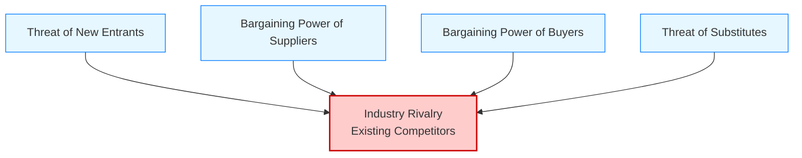

# Porter's 5 Forces Analysis

**Category:** Strategic Analysis and Environmental Scanning

## 1. Executive Summary (TL;DR)
Porter's 5 Forces Analysis is a framework used to determine **how profitable** and **how attractive** an industry is. It argues that competition is not limited to "rival firms" but includes customers, suppliers, and alternative products as part of the competitive ecosystem.

* **Purpose:** To measure competitive intensity and long-term profitability potential in an industry.
* **Use Cases:** Evaluating a new business idea, market entry strategies, or understanding why profitability is declining in an existing business.

---

## 2. Origin and History
* **Emergence:** 1979.
* **Creator:** Harvard Business School professor **Michael E. Porter**.
* **Source:** "How Competitive Forces Shape Strategy" (Harvard Business Review) article.
* **Revolutionary Aspect:** It shifted the simple perspective of the time, which focused only on "competitors" and SWOT analysis, by defining competition as an "ecosystem".

---

## 3. Basic Structure of the Model (5 Forces)

According to Porter, the fate of an industry is determined by these 5 fundamental forces.

### 📋 Detailed Explanation

| Force | Definition | When is the Danger High? |
| :--- | :--- | :--- |
| **1. Rivalry Among Existing Competitors** | The intensity of the race to get a share of the pie. | If competitors are equal in size, the market is not growing, and fixed costs are high (price wars begin). |
| **2. Threat of New Entrants** | How easy it is for new players to enter the sector (Entry Barriers). | If capital requirements are low, no proprietary technology is needed, and there are no regulations, anyone can do this business. |
| **3. Bargaining Power of Suppliers** | The power of those supplying raw materials or services to dictate prices. | If there are few suppliers or if switching suppliers (Switching Cost) is very expensive. |
| **4. Bargaining Power of Buyers** | The pressure from customers to drive down prices or increase quality. | If there are few customers but their purchase volumes are large; or if the customer has many alternative options. |
| **5. Threat of Substitute Products** | Solutions of a **different type** that can replace your product. | *Example:* For an airline company, the substitute product is not another airline, but a "High-Speed Train" or a "Zoom Meeting". |

---

## 4. Implementation Steps

1.  **Define the Industry:** The analysis should not be for the "general tech market" but specifically for the "Embedded Systems Software Market". Draw the boundaries clearly.
2.  **Score the 5 Forces:** Rate each item as *Low / Medium / High*.
3.  **Profitability Analysis:**
    * If Forces are **High** = Profitability Decreases (Industry not attractive).
    * If Forces are **Low** = Profitability Increases (Industry attractive).
4.  **Develop Strategy:** How will you build defenses against the strong forces?

---

## 5. Critical Questions

* **Entry Barrier:** Can 3 engineers come together tomorrow morning and do our job? (If yes, the barrier is low).
* **Supplier:** Are we dependent on a single manufacturer for the chip we use (e.g., ESP32)?
* **Customer:** Does our biggest customer make up 50% of our turnover? (If so, they are the boss).
* **Substitute:** Can the customer get the job done with Excel instead of buying our software?

---

## 6. Advantages and Constraints

### ✅ Advantages
* **Depth:** Shows not just today, but the structural risks of the industry.
* **Go/No-Go Decision:** Plays a vital role in the decision to enter or not enter a sector.
* **Power Balance:** Clarifies whose hand is stronger (buyer or seller).

### ⚠️ Constraints
* **Externally Focused:** Ignores the firm's own capabilities (Internal Strength) (VRIO is used for this).
* **Lack of Dynamism:** Difficult to apply in very fast-changing digital sectors (Blue Ocean) where boundaries are blurred.
* **Government Factor:** In the original model, "Government" is not a separate force (Regulations can sometimes be the 6th force).

---

## 7. Example Scenario: "CodeBrew" (Embedded Systems Sector)

**Industry:** Industrial Embedded Software and IoT Solutions.

| Force | Status | Comment for CodeBrew |
| :--- | :--- | :--- |
| **Threat of New Entrants** | **Medium/High** | Anyone with a laptop can write software. However, "Industrial Reliability" and hardware knowledge requirements raise the barrier slightly. |
| **Power of Suppliers** | **High** | Full dependency on global chip manufacturers (ST, Espressif, etc.). When there is a chip crisis, the supplier calls the shots. |
| **Power of Buyers** | **Medium** | Customers (Factories) need CodeBrew because they don't know technical details. However, price negotiation is tough in project-based work. |
| **Threat of Substitutes** | **Medium** | Instead of custom software, the customer can use off-the-shelf PLC solutions (Siemens, etc.). This is a serious alternative. |
| **Intensity of Rivalry** | **High** | There are too many freelance engineers and small software houses in the market. Price competition is intense. |

**Conclusion:** The industry is tough (Forces are high). To escape price competition, CodeBrew must **"Specialize in a Niche Area"** (e.g., only medical device software) and become an indispensable partner for the customer.

---
🔙 [Back to Home](../../README.md)