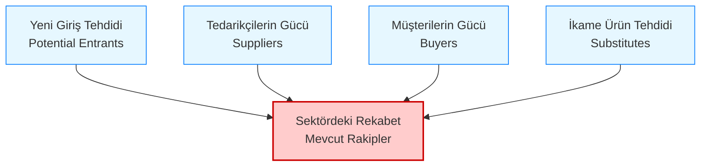

# Porter'ın 5 Güç Analizi

**Kategori:** Stratejik Analiz ve Durum Değerlendirme

## 1. Yönetici Özeti (TL;DR)
Porter'ın 5 Güç Analizi; bir sektörün **ne kadar kârlı** ve **ne kadar çekici** olduğunu belirlemek için kullanılan bir çerçevedir. Rekabetin sadece "rakip firmalarla" sınırlı olmadığını, müşterilerin, tedarikçilerin ve alternatif ürünlerin de rekabetin bir parçası olduğunu savunur.

* **Amaç:** Sektördeki rekabet yoğunluğunu ve uzun vadeli kârlılık potansiyelini ölçmek.
* **Kullanım Alanı:** Yeni bir iş fikrini değerlendirirken, pazar giriş stratejilerinde veya mevcut işin kârlılığının neden düştüğünü anlamada.

---

## 2. Kökeni ve Tarihçesi
* **Ortaya Çıkış:** 1979.
* **Yaratıcısı:** Harvard Business School profesörü **Michael E. Porter**.
* **Kaynak:** "How Competitive Forces Shape Strategy" (Harvard Business Review) makalesi.
* **Devrim Niteliği:** O dönemdeki sadece "rakiplere" ve SWOT analizine odaklanan basit bakış açısını değiştirmiş, rekabeti bir "ekosistem" olarak tanımlamıştır.

---

## 3. Modelin Temel Yapısı (5 Kuvvet)

Porter'a göre bir sektörün kaderini şu 5 temel kuvvet belirler.

### 📋 Detaylı Açıklama

| Kuvvet | Tanım | Tehlike Ne Zaman Yüksektir? |
| :--- | :--- | :--- |
| **1. Mevcut Rakipler Arasındaki Rekabet** | Pastadan pay kapmak için yapılan yarışın şiddeti. | Rakipler birbirine denkse, pazar büyümüyorsa ve sabit maliyetler yüksekse (fiyat kırma savaşı başlar). |
| **2. Yeni Giriş Tehdidi** | Sektöre yeni oyuncuların girmesinin ne kadar kolay olduğu (Giriş Bariyerleri). | Sermaye ihtiyacı düşükse, özel teknoloji gerekmiyorsa ve regülasyon yoksa herkes bu işi yapabilir. |
| **3. Tedarikçilerin Gücü** | Ham madde veya hizmet sağlayanların fiyatları dikte etme gücü. | Tedarikçi sayısı azsa veya tedarikçi değiştirmek (Switching Cost) çok maliyetliyse. |
| **4. Müşterilerin Gücü** | Müşterilerin fiyatları aşağı çekme veya kaliteyi artırma baskısı. | Müşteri sayısı azsa ama alım hacimleri büyükse; veya müşterinin alternatif seçeneği çoksa. |
| **5. İkame (Alternatif) Ürün Tehdidi** | Sizin ürününüzün yerini tutabilecek **farklı türdeki** çözümler. | *Örnek:* Uçak firması için ikame ürün başka bir havayolu değil, "Hızlı Tren" veya "Zoom Toplantısı"dır. |

---

## 4. Uygulama Adımları

1.  **Sektörü Tanımlayın:** Analiz "genel teknoloji pazarı" için değil, spesifik olarak "Gömülü Sistemler Yazılım Pazarı" için yapılmalıdır. Sınırları net çizin.
2.  **5 Kuvveti Puanlayın:** Her bir madde için *Düşük / Orta / Yüksek* şeklinde not verin.
3.  **Kârlılık Analizi:**
    * Kuvvetler **Yüksekse** = Kârlılık Düşer (Sektör Çekici Değil).
    * Kuvvetler **Düşükse** = Kârlılık Artar (Sektör Cazip).
4.  **Strateji Geliştirin:** Güçlü olan kuvvetlere karşı nasıl savunma kuracaksınız?

---

## 5. Kritik Sorular

* **Giriş Bariyeri:** Yarın sabah 3 mühendis bir araya gelip bizim işimizi yapabilir mi? (Yapabilirse bariyer düşüktür).
* **Tedarikçi:** Kullandığımız çipin (Örn: ESP32) tek üreticisine mi bağımlıyız?
* **Müşteri:** En büyük müşterimiz ciromuzun %50'sini mi oluşturuyor? (Öyleyse patron odur).
* **İkame:** Müşteri bizim yazılımı almak yerine Excel ile işini görebilir mi?

---

## 6. Avantajlar ve Kısıtlar

### ✅ Avantajları
* **Derinlik:** Sadece bugünü değil, sektörün yapısal risklerini gösterir.
* **Giriş/Çıkış Kararı:** Bir sektöre girip girmeme kararında hayati rol oynar.
* **Güç Dengesi:** Kimin (alıcı mı, satıcı mı) elinin daha güçlü olduğunu netleştirir.

### ⚠️ Kısıtları
* **Dışa Odaklı:** Firmanın kendi yeteneklerini (İçsel Güç) göz ardı eder (Bunun için VRIO kullanılır).
* **Dinamizm Eksikliği:** Çok hızlı değişen dijital sektörlerde (Blue Ocean) sınırlar belirsiz olduğu için uygulaması zordur.
* **Devlet Faktörü:** Orijinal modelde "Devlet" ayrı bir güç olarak yoktur (Regülasyonlar bazen 6. güç olabilir).

---

## 7. Örnek Senaryo: "CodeBrew" (Gömülü Sistemler Sektörü)

**Sektör:** Endüstriyel Gömülü Yazılım ve IoT Çözümleri.

| Kuvvet | Durum | CodeBrew İçin Yorum |
| :--- | :--- | :--- |
| **Yeni Giriş Tehdidi** | **Orta/Yüksek** | Bir laptopu olan herkes yazılım yazabilir. Ancak "Endüstriyel Güvenilirlik" ve donanım bilgisi gerektirmesi bariyeri biraz yükseltir. |
| **Tedarikçilerin Gücü** | **Yüksek** | Global çip üreticilerine (ST, Espressif vb.) tam bağımlılık var. Çip krizi olduğunda tedarikçinin dediği olur. |
| **Müşterilerin Gücü** | **Orta** | Müşteriler (Fabrikalar) teknik detayları bilmediği için CodeBrew'a muhtaçtır. Ancak proje bazlı işlerde fiyat pazarlığı serttir. |
| **İkame Ürün Tehdidi** | **Orta** | Müşteri özel yazılım yazdırmak yerine hazır PLC çözümleri (Siemens vb.) kullanabilir. Bu ciddi bir alternatiftir. |
| **Rekabet Şiddeti** | **Yüksek** | Piyasada çok fazla freelance mühendis ve küçük yazılım evi var. Fiyat rekabeti yoğundur. |

**Sonuç:** Sektör zorlu (Kuvvetler yüksek). CodeBrew, fiyat rekabetinden kaçmak için **"Niş Bir Alanda Uzmanlaşmalı"** (Örn: Sadece medikal cihaz yazılımları) ve müşterinin vazgeçemeyeceği bir partner olmalıdır.

---
🔙 [Ana Sayfaya Dön](../../README.tr.md)