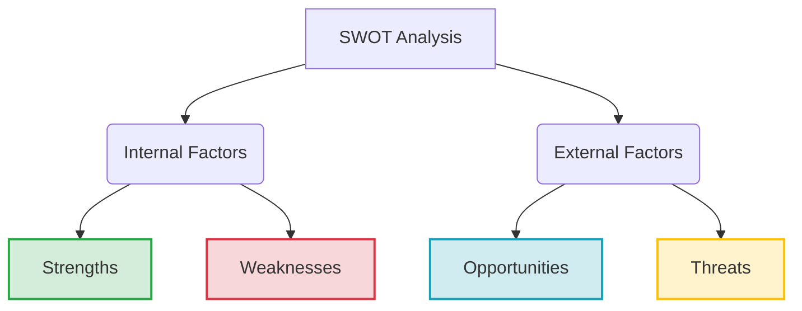

# SWOT Analysis

**Category:** Strategic Analysis and Environmental Scanning

## 1. Executive Summary (TL;DR)
SWOT Analysis is a fundamental strategic planning tool that examines the current status of an organization, project, or individual in terms of **Internal (Strengths and Weaknesses)** and **External (Opportunities and Threats)** factors. It is used to see the "big picture" right before the decision-making process.

* **Purpose:** To clarify the current situation and provide data for strategy development.
* **Use Cases:** Strategic planning, product launches, competitor analysis, personal career planning.

---

## 2. Origin and History
* **Emergence:** 1960s and 70s.
* **Origin:** Accepted to be developed by **Albert Humphrey** during research projects at Stanford University (Although there are debates about its exact origin, this is the most accepted name in literature).
* **Story:** Originally named **SOFT** (Satisfactory, Opportunity, Fault, Threat), it later evolved into today's SWOT. It was developed to analyze the planning failures of Fortune 500 companies.

---

## 3. Basic Structure of the Model (4 Components)

SWOT is built on a 2x2 matrix. The most critical distinction is between **Internal (Controllable)** and **External (Uncontrollable)** factors.

### 📋 Detailed Explanation

| Factor | Definition | Focus Question | Examples |
| :--- | :--- | :--- | :--- |
| **S - Strengths** | Internal attributes where the organization excels, outperforms competitors, and has control. | *What do we do better than others?* | Patents, brand value, cash reserves, talented team. |
| **W - Weaknesses** | Internal liabilities that slow down the organization, create disadvantages, and need improvement. | *Which of our processes are inefficient or lacking?* | Outdated technology, high debt, insufficient marketing, staff shortage. |
| **O - Opportunities** | External situations outside the organization's control that, if exploited, could lead to growth. | *Which market trend can we turn to our favor?* | New regulations, competitor bankruptcy, changing consumer habits. |
| **T - Threats** | External risks coming from the environment that could hinder the organization's success. | *What can block us from the outside?* | Economic crisis, new strong competitors, supply chain disruptions. |

---

## 4. Implementation Steps (How-to?)

1.  **Define the Goal:** What is the analysis for? (e.g., "Entering a new market" or "2026 Corporate Strategy").
2.  **Collect Data:** Brainstorm with your team. Put customer feedback, financial reports, and market research on the table.
3.  **Fill the Matrix:**
    * First, write down **Internal** factors (S and W). Be honest.
    * Then, write down **External** factors (O and T). Using **PESTEL Analysis** here is very effective.
4.  **Analysis and Strategy (TOWS Transition):** Listing is not enough. Create matches:
    * *How can I use my Strengths to seize Opportunities?*
    * *How can I use my Strengths to defend against Threats?*

---

## 5. Critical Questions (5W1H Approach)

Ask these questions to avoid getting stuck during the analysis:

* **Who?** Who are our competitors and what do they do differently from us?
* **What?** What is our Unique Selling Proposition (USP)?
* **Where?** In which geography or market segment are we vulnerable?
* **When?** When will this opportunity window close?
* **Why?** Why do customers prefer the competitor over us? (For weakness detection).

---

## 6. Advantages and Constraints

### ✅ Advantages
* **Simple:** Does not require special training or technical knowledge.
* **Cost-effective:** Pen and paper are sufficient.
* **Big Picture:** Visualizes complex problems by simplifying them.

### ⚠️ Constraints (Points to Consider)
* **Subjectivity:** Can be based on personal opinions; misleading if not supported by data.
* **Lack of Prioritization:** 10 items may look equal to 1 item in importance (Weighting should be done).
* **Static Structure:** Shows only the current state; if the market changes fast, the analysis shelf life is short.

---

## 7. Example Scenario: "CodeBrew" (Next-Gen Software Company)

**Scenario:** An Ankara-based software office of 10 people working on embedded systems.

| **STRENGTHS (Internal)** | **WEAKNESSES (Internal)** |
| :--- | :--- |
| 1. Experienced engineering staff (Mostly Seniors). 2. Self-developed open-source libraries. 3. Agile decision-making mechanism. | 1. Lack of marketing and sales team. 2. Project-based cash flow (Irregular income). 3. Lack of documentation. |
| **OPPORTUNITIES (External)** | **THREATS (External)** |
| 1. Increasing localization demand in the defense industry. 2. Global increase in interest in IoT devices. 3. Rising exchange rates making exports profitable. | 1. Brain drain risk (Loss of personnel). 2. Global chip crisis (Hardware supply issues). 3. Big integrators dominating the market. |

**Conclusion:** CodeBrew is technically very strong (S) but has weak sales muscles (W). It must urgently hire a business development specialist or find a global partner to exploit the export opportunity (O).

---
🔙 [Back to Home](../../README.md)