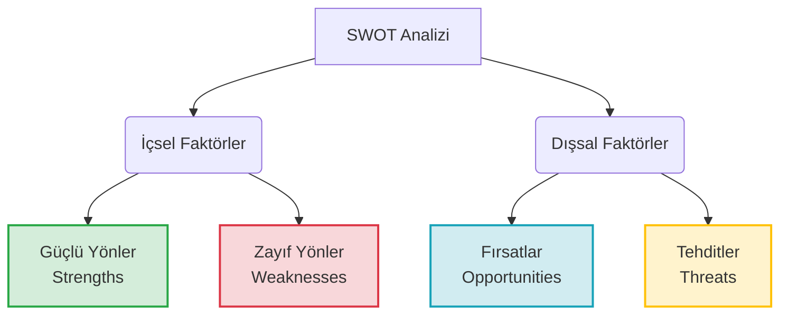

# SWOT Analizi

**Kategori:** Stratejik Analiz ve Durum Değerlendirme

## 1. Yönetici Özeti (TL;DR)
SWOT Analizi; bir organizasyonun, projenin veya kişinin mevcut durumunu **İçsel (Güçlü ve Zayıf Yönler)** ve **Dışsal (Fırsatlar ve Tehditler)** faktörler açısından inceleyen temel bir stratejik planlama aracıdır. Karar verme sürecinden hemen önce "büyük resmi" görmek için kullanılır.

* **Amaç:** Mevcut durumu netleştirmek ve strateji geliştirmek için veri sağlamak.
* **Kullanım Alanı:** Stratejik planlama, ürün lansmanı, rekabet analizi, kişisel kariyer planlama.

---

## 2. Kökeni ve Tarihçesi
* **Ortaya Çıkış:** 1960'lı ve 70'li yıllar.
* **Köken:** Stanford Üniversitesi'ndeki araştırma projeleri sırasında **Albert Humphrey** tarafından geliştirildiği kabul edilir (Kesin kökeni hakkında tartışmalar olsa da literatürde en kabul gören isimdir).
* **Hikayesi:** Orijinal çalışmada **SOFT** (Satisfactory, Opportunity, Fault, Threat) olarak adlandırılmış, daha sonra bugünkü SWOT halini almıştır. Fortune 500 şirketlerinin planlama başarısızlıklarını analiz etmek amacıyla geliştirilmiştir.

---

## 3. Modelin Temel Yapısı (4 Bileşen)

SWOT, 2x2'lik bir matris üzerine kuruludur. Bu matrisin en kritik ayrımı **İçsel (Kontrol edilebilir)** ve **Dışsal (Kontrol edilemez)** faktörlerdir.

### 📋 Detaylı Açıklama

| Faktör | Tanım | Odak Sorusu | Örnekler |
| :--- | :--- | :--- | :--- |
| **S - Strengths (Güçlü Yönler)** | Kurumun başarılı olduğu, rakiplerinden üstün olduğu ve kontrol edebildiği içsel özelliklerdir. | *Neyi diğerlerinden daha iyi yapıyoruz?* | Patentler, marka değeri, nakit gücü, yetenekli ekip. |
| **W - Weaknesses (Zayıf Yönler)** | Kurumu yavaşlatan, dezavantaj yaratan ve iyileştirilmesi gereken içsel eksikliklerdir. | *Hangi süreçlerimiz verimsiz veya eksik?* | Eski teknoloji, yüksek borç, yetersiz pazarlama, personel eksikliği. |
| **O - Opportunities (Fırsatlar)** | Kurumun kontrolü dışında gelişen ancak değerlendirilirse büyüme sağlayacak dışsal durumlardır. | *Piyasadaki hangi trendi lehimize çevirebiliriz?* | Yeni yasal düzenlemeler, rakibin iflası, değişen tüketici alışkanlıkları. |
| **T - Threats (Tehditler)** | Kurumun başarısını engelleyebilecek, dış çevreden gelen risklerdir. | *Bizi dışarıdan ne engelleyebilir?* | Ekonomik kriz, yeni güçlü rakipler, tedarik zinciri kopmaları. |

---

## 4. Uygulama Adımları (Nasıl Yapılır?)

1.  **Hedefi Belirleyin:** Analiz ne için yapılıyor? (Örn: "Yeni bir pazara giriş" veya "2026 Yılı Şirket Stratejisi").
2.  **Veri Toplayın:** Ekibinizle beyin fırtınası yapın. Müşteri geri bildirimlerini, finansal raporları ve pazar araştırmalarını masaya koyun.
3.  **Matrisi Doldurun:**
    * Önce **İçsel** faktörleri (S ve W) yazın. Dürüst olun.
    * Sonra **Dışsal** faktörleri (O ve T) yazın. Burada **PESTEL Analizi**'nden faydalanmak çok etkilidir.
4.  **Analiz ve Strateji (TOWS Geçişi):** Sadece listelemek yetmez. Eşleştirme yapın:
    * *Güçlü yönlerimi kullanarak Fırsatları nasıl yakalarım?*
    * *Güçlü yönlerimi kullanarak Tehditleri nasıl savuştururum?*

---

## 5. Kritik Sorular (5N1K Yaklaşımı)

Analiz sırasında tıkanmamak için şu soruları sorun:

* **Kim?** Rakiplerimiz kim ve bizden neyi farklı yapıyorlar?
* **Ne?** En eşsiz kaynağımız (USP - Unique Selling Proposition) ne?
* **Nerede?** Hangi coğrafyada veya pazar segmentinde savunmasızız?
* **Ne Zaman?** Bu fırsat penceresi ne zaman kapanacak?
* **Neden?** Müşteriler neden bizi değil de rakibi tercih ediyor? (Zayıf yön tespiti için).

---

## 6. Avantajlar ve Kısıtlar

### ✅ Avantajları
* **Basittir:** Özel bir eğitim veya teknik bilgi gerektirmez.
* **Maliyetsizdir:** Kağıt ve kalem yeterlidir.
* **Büyük Resim:** Karmaşık sorunları basitleştirerek görselleştirir.

### ⚠️ Kısıtları (Dikkat Edilmesi Gerekenler)
* **Öznellik:** Kişisel görüşlere dayalı olabilir, veri ile desteklenmezse yanıltıcıdır.
* **Önceliklendirme Eksikliği:** 10 madde ile 1 madde aynı önemde görünebilir. (Ağırlıklandırma yapılmalıdır).
* **Statik Yapı:** Sadece o anki durumu gösterir, pazar çok hızlı değişiyorsa analizin ömrü kısa olur.

---

## 7. Örnek Senaryo: "CodeBrew" (Yeni Nesil Yazılım Şirketi)

**Senaryo:** Ankara merkezli, gömülü sistemler üzerine çalışan 10 kişilik bir yazılım ofisi.

| **GÜÇLÜ YÖNLER (Internal)** | **ZAYIF YÖNLER (Internal)** |
| :--- | :--- |
| 1. Deneyimli mühendis kadrosu (Senior ağırlıklı). 2. Kendi geliştirdikleri açık kaynak kütüphaneler. 3. Çevik (Agile) karar alma mekanizması. | 1. Pazarlama ve satış ekibinin olmaması. 2. Nakit akışının proje bazlı olması (Düzensiz gelir). 3. Dokümantasyon eksikliği. |
| **FIRSATLAR (External)** | **TEHDİTLER (External)** |
| 1. Savunma sanayiinde artan yerlileşme talebi. 2. IoT cihazlarına olan global ilgi artışı. 3. Dolar kurundaki artışın ihracatı karlı kılması. | 1. Beyin göçü riski (Personel kaybı). 2. Global çip krizi (Donanım tedarik sorunları). 3. Büyük entegratörlerin pazarı domine etmesi. |

**Sonuç Yorumu:** CodeBrew teknik olarak çok güçlü (S) ancak satış kasları zayıf (W). İhracat fırsatını (O) değerlendirmek için acilen bir iş geliştirme uzmanı istihdam etmeli veya global bir partner bulmalı.

---
🔙 [Ana Sayfaya Dön](../../README.tr.md)