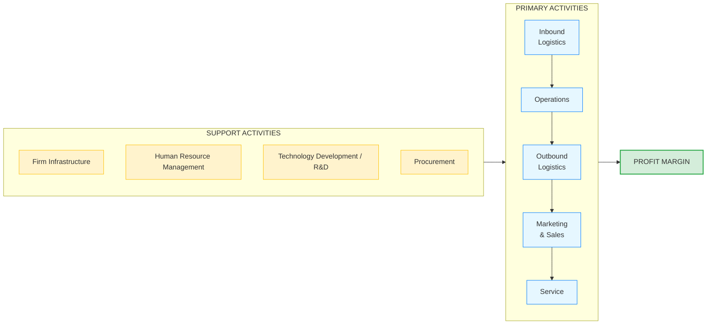

# Porter's Value Chain Analysis

**Category:** Strategic Analysis and Operational Efficiency (Internal Analysis)

## 1. Executive Summary (TL;DR)
Value Chain Analysis is a model that examines all the steps a product or service goes through, starting from raw materials until it reaches the customer (and the subsequent support process).

* **Purpose:** To identify which activities within the company create "value" in the eyes of the customer and which activities are merely "cost" items.
* **Philosophy:** Profit Margin = Total Value Created - Total Cost incurred to create this value.
* **Use Cases:** When you want to increase operational efficiency, reduce costs, or gain a competitive advantage by differentiating the product.

---

## 2. Origin and History
* **Emergence:** 1985.
* **Creator:** Harvard Business School professor **Michael E. Porter** (also the creator of the 5 Forces Analysis).
* **Source:** His book "Competitive Advantage: Creating and Sustaining Superior Performance".
* **Contribution:** Defined companies not merely as structures composed of "departments," but as an interconnected whole of "value-creating processes."

---

## 3. Basic Structure of the Model (Primary and Support Activities)

Porter divides company activities into two main groups. The perfect harmony of these activities ultimately creates the company's **Profit Margin**.

### 📋 Detailed Explanation

**A. Primary Activities (Directly Touching the Product):**
1. **Inbound Logistics:** The arrival, storage, and distribution of raw materials to production.
2. **Operations:** The production/coding phase where raw material is transformed into the final product.
3. **Outbound Logistics:** Storage and distribution of the finished product to the customer.
4. **Marketing & Sales:** Persuading the customer to buy the product, pricing, advertising.
5. **Service:** Post-sale installation, training, repair, and warranty services.

**B. Support Activities (Keeping the System Running in the Background):**
1. **Firm Infrastructure:** General management, finance, accounting, legal affairs.
2. **Human Resource Management:** Recruitment, training, motivation, and rewarding.
3. **Technology Development:** R&D, product design, internal software that accelerates processes.
4. **Procurement:** Market research and purchasing of machinery, equipment, and raw materials needed for primary activities.

---

## 4. Implementation Steps

1. **Map the Activities:** Place all business processes in your company into the 9 boxes above.
2. **Conduct Value and Cost Analysis:** How much does each step add to the price the customer is willing to pay? What is its cost to us?
3. **Examine Linkages:** How does a mistake in one step affect another? (e.g., If "Procurement" buys cheap but low-quality material, the fault/warranty costs of the "Service" unit will explode).
4. **Optimization:** Invest in areas where you do better than competitors; outsource steps that only generate costs and add no value.

---

## 5. Critical Questions

* Why does the customer pay for our product? For flawless "Operations" or for great "After-Sales Service"?
* At which link in the chain do we spend the most money (cost)? Does the customer care about this expense?
* Do our support units like "Human Resources" or "Firm Infrastructure" really accelerate the core production process, or do they create bureaucracy?

---

## 6. Advantages and Constraints

### ✅ Advantages
* **Cost Control:** Clearly shows exactly where money is being "burned".
* **Points of Differentiation:** Helps to gain a competitive advantage by finding a weak link in the competitor (e.g., if the competitor's after-sales service is poor).
* **Process Integrity:** Proves that departments are not independent silos.

### ⚠️ Constraints
* **Data Requirement:** Calculating the exact cost of each step requires serious accounting infrastructure and time.
* **Adaptation to Service Sector:** The original model is focused on physical "production" (factory). Adapting it to service sectors like software or consulting requires some flexibility.

---

## 7. Example Scenario: "CodeBrew" (Process Optimization)

**Scenario:** CodeBrew develops industrial embedded systems and hardware designs. Let's look at which steps the company creates added value:

| Chain Link | Equivalent at CodeBrew | Status Assessment |
| :--- | :--- | :--- |
| **Inbound Logistics** | Smooth importation of ESP32 chips and DWIN screens from China or distributors. | Not critical, a standard process. |
| **Operations** | PCB design in Altium and writing C/C++ codes (business logic) for the hardware. | **HIGH VALUE:** This is the heart of the company. Code quality and design expertise. |
| **Outbound Logistics** | Safe transportation of completed industrial panels to factories. | Standard courier / shipping job. |
| **Marketing / Sales** | Preparing proposals for global clients on Upwork, producing sectoral content on LinkedIn, and sharing open-source repos on GitHub. | **HIGH VALUE:** Where global network and engineering reputation are built. |
| **Service** | Releasing remote updates and maintaining devices in the field after sales. | Critical to retain the customer (Recurring revenue). |
| **Technology Dev. (Support)** | Writing a universal DWIN HMI library and standardizing its use in internal projects. | **LEVERAGE:** Cuts the "coding" time in the Operations step by half. |

**Conclusion:** The areas where CodeBrew adds real value to the customer are **Operations** and strong **Marketing (Network)**. Steps like logistics are merely costs and should be kept to a minimum or outsourced. At the same time, investing in internal *Technology Development* will incredibly accelerate the core operation.

---
🔙 [Back to Home](../../README.md)