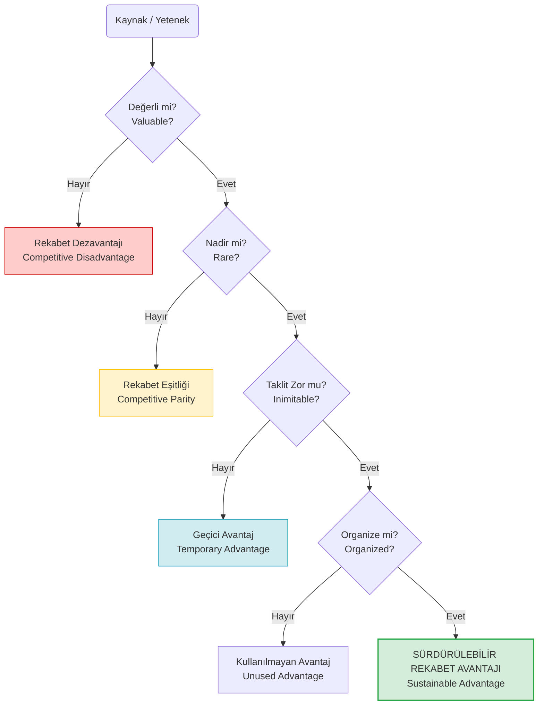

# VRIO Çerçevesi (VRIO Analizi)

**Kategori:** Stratejik Analiz ve Durum Değerlendirme (İçsel Analiz)

## 1. Yönetici Özeti (TL;DR)
VRIO Çerçevesi; bir işletmenin sahip olduğu kaynakların ve yeteneklerin, rakiplerine karşı **Sürdürülebilir Rekabet Avantajı** sağlayıp sağlamadığını test eden bir analiz aracıdır.

* **Açılımı:** **V**alue (Değer), **R**arity (Nadirlik), **I**mitability (Taklit Edilemezlik), **O**rganization (Organizasyon).
* **Amaç:** Şirketin "öz yeteneklerini" (Core Competencies) belirlemek.
* **Kullanım Alanı:** Stratejik planlama, kaynak tahsisi ve iç denetim süreçlerinde.

---

## 2. Kökeni ve Tarihçesi
* **Ortaya Çıkış:** 1991.
* **Yaratıcısı:** Strateji profesörü **Jay Barney**.
* **Teori:** "Resource-Based View" (Kaynak Temelli Görüş) teorisinin temel taşıdır. Barney, rekabet avantajının dış pazardan değil, şirketin iç kaynaklarından geldiğini savunur.
* **Evrim:** İlk başta VRIN (Non-substitutable) olarak ortaya çıkmış, daha sonra uygulanabilirliği artırmak için VRIO'ya evrilmiştir.

---

## 3. Modelin Temel Yapısı (Karar Ağacı)

VRIO, bir kaynağı 4 aşamalı bir filtreden geçirir. Her "Evet" cevabı, rekabet avantajını bir üst seviyeye taşır.

### 📋 Detaylı Açıklama

| Soru | Açıklama |
| :--- | :--- |
| **1. Değerli mi? (Value)** | Bu kaynak, bir fırsatı değerlendirmemize veya bir tehdidi savuşturmamıza yarıyor mu? Müşteri buna para öder mi?  *(Cevap Hayır ise: Dezavantajlısınız)* |
| **2. Nadir mi? (Rarity)** | Bu kaynağa sadece biz mi sahibiz, yoksa her rakipte var mı?  *(Cevap Hayır ise: Herkeste var, sadece oyunda kalırsınız - Eşitlik)* |
| **3. Taklit Edilebilir mi? (Imitability)** | Rakiplerin bu kaynağı kopyalaması pahalı veya zor mu? (Patent, marka, karmaşık süreçler).  *(Cevap Hayır ise: Rakipler yakında sizi yakalar - Geçici Avantaj)* |
| **4. Organizasyon Uygun mu? (Organization)** | Şirketin yönetim yapısı, kültürü ve süreçleri bu kaynağı paraya dönüştürmeye uygun mu?  *(Cevap Evet ise: Altın madeni - Sürdürülebilir Avantaj)* |

---

## 4. Uygulama Adımları

1.  **Kaynakları Listele:** Sahip olduğunuz her şeyi yazın.
    * *Somut:* Nakit, ekipman, binalar.
    * *Soyut:* Marka, patentler, bilgi birikimi (Know-how), şirket kültürü.
2.  **Test Et:** Her bir kaynağı sırasıyla V-R-I-O sorularına tabi tutun.
3.  **Sınıflandır:** Kaynağın size ne tür bir avantaj (veya dezavantaj) sağladığını belirleyin.
4.  **Aksiyon Al:**
    * *Eşitlik sağlayanları* koruyun (standartları düşürmeyin).
    * *Sürdürülebilir olanlara* yatırım yapın (bunlar sizin kalenizdir).

---

## 5. Kritik Sorular

* **Değer:** Bu yeteneğimiz maliyetleri düşürüyor mu veya geliri artırıyor mu?
* **Nadirlik:** Piyasada bunu yapabilen başka kaç firma var?
* **Taklit:** Bir rakibin bunu geliştirmesi kaç yıl ve kaç dolar sürer?
* **Organizasyon:** Satış ekibimiz bu harika teknolojiyi satmaya hazır mı?

---

## 6. Avantajlar ve Kısıtlar

### ✅ Avantajları
* **İçe Bakış:** Şirketin gerçekten neyde iyi olduğunu (ve neyde sıradan olduğunu) dürüstçe gösterir.
* **Odaklanma:** Gereksiz kaynaklara yatırım yapmayı engeller.
* **Uzun Vade:** Geçici başarılar ile kalıcı başarıları ayırt eder.

### ⚠️ Kısıtları
* **Statik:** Pazar değiştiğinde "Değerli" olan bir kaynak, bir gecede "Değersiz" olabilir (Örn: Kodak'ın film teknolojisi).
* **Belirsizlik:** Bir kaynağın ne kadar "taklit edilemez" olduğunu kestirmek bazen zordur.

---

## 7. Örnek Senaryo: "CodeBrew" (Kaynak Analizi)

**Senaryo:** CodeBrew yazılım ofisinin kaynaklarını VRIO testine sokuyoruz.

| Kaynak / Yetenek | Değerli? | Nadir? | Taklit Zor mu? | Organize mi? | Sonuç (Rekabet Durumu) |
| :--- | :--- | :--- | :--- | :--- | :--- |
| **Python/C++ Bilgisi** | ✅ Evet | ❌ Hayır | - | - | **Rekabet Eşitliği**  *(Her yazılım şirketinde var.)* |
| **Özel DWIN HMI Kütüphanesi** | ✅ Evet | ✅ Evet | ❌ Hayır | - | **Geçici Avantaj**  *(Rakipler de benzer kütüphane yazabilir, kod açık kaynaksa kolayca alınır.)* |
| **Kurucu Ekibin Sektör Network'ü** | ✅ Evet | ✅ Evet | ✅ Evet | ✅ Evet | **Sürdürülebilir Avantaj**  *(Yılların güven ilişkisini kopyalamak imkansızdır.)* |
| **Ofis Binası** | ❌ Hayır | - | - | - | **Rekabet Dezavantajı**  *(Maliyet yaratıyor ama projeye katkısı yok, evden de çalışılabilir.)* |

**Yorum:** CodeBrew'un asıl gücü yazdığı kodlar değil (çünkü kopyalanabilir), kurduğu **sektörel ilişkiler ve uzmanlık geçmişidir.** Stratejiyi bunun üzerine kurmalıdır.

---
🔙 [Ana Sayfaya Dön](../../README.tr.md)