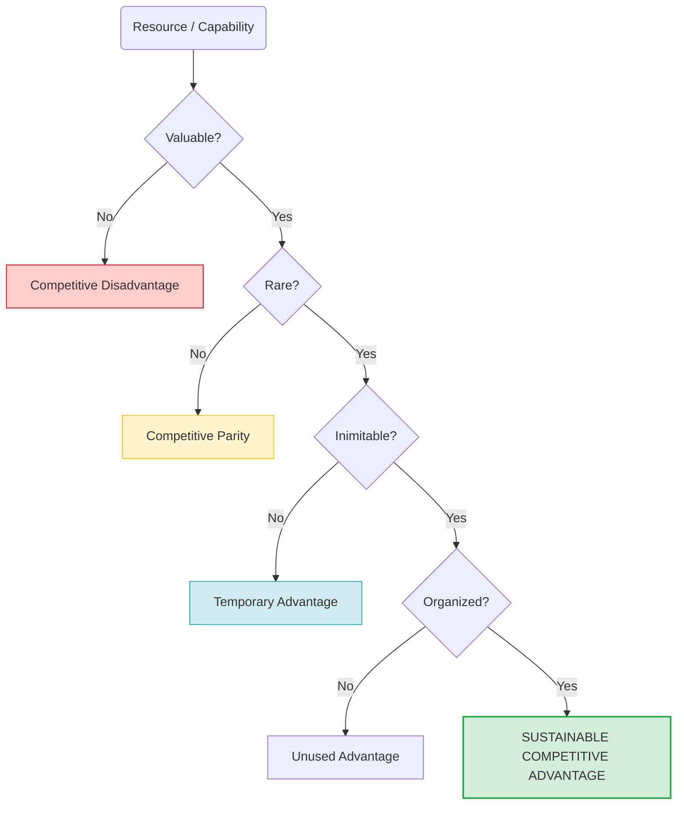

# VRIO Framework (VRIO Analysis)

**Category:** Strategic Analysis and Situation Assessment (Internal Analysis)

## 1. Executive Summary (TL;DR)
The VRIO Framework is an analysis tool used to test whether an organization's resources and capabilities provide a **Sustainable Competitive Advantage** over its competitors.

* **Acronym:** **V**alue, **R**arity, **I**mitability, **O**rganization.
* **Purpose:** To identify the company's "Core Competencies".
* **Use Cases:** Strategic planning, resource allocation, and internal audit processes.

---

## 2. Origin and History
* **Emergence:** 1991.
* **Creator:** Strategy professor **Jay Barney**.
* **Theory:** It is the cornerstone of the "Resource-Based View" (RBV) theory. Barney argues that competitive advantage comes not from the external market, but from the company's internal resources.
* **Evolution:** Originally emerged as VRIN (Non-substitutable), later evolved into VRIO to increase applicability.

---

## 3. Basic Structure of the Model (Decision Tree)

VRIO passes a resource through a 4-stage filter. Each "Yes" answer takes the competitive advantage to the next level.

### 📋 Detailed Explanation

| Question | Explanation |
| :--- | :--- |
| **1. Is it Valuable?** | Does this resource help us exploit an opportunity or neutralize a threat? Would the customer pay for it?  *(If No: You are at a Disadvantage)* |
| **2. Is it Rare?** | Do only we possess this resource, or does every competitor have it?  *(If No: Everyone has it, you just stay in the game - Parity)* |
| **3. Is it Inimitable?** | Is it expensive or difficult for competitors to copy this resource? (Patent, brand, complex processes).  *(If No: Competitors will catch up soon - Temporary Advantage)* |
| **4. Is it Organized?** | Are the company's management structure, culture, and processes suitable to turn this resource into profit?  *(If Yes: Gold mine - Sustainable Advantage)* |

---

## 4. Implementation Steps

1.  **List Resources:** Write down everything you have.
    * *Tangible:* Cash, equipment, buildings.
    * *Intangible:* Brand, patents, know-how, company culture.
2.  **Test:** Subject each resource to V-R-I-O questions sequentially.
3.  **Classify:** Determine what kind of advantage (or disadvantage) the resource provides you.
4.  **Take Action:**
    * Protect those providing *Parity* (don't lower standards).
    * Invest in those providing *Sustainability* (these are your fortress).

---

## 5. Critical Questions

* **Value:** Does this capability reduce costs or increase revenue?
* **Rarity:** How many other firms in the market can do this?
* **Imitability:** How many years and dollars would it take for a competitor to develop this?
* **Organization:** Is our sales team ready to sell this great technology?

---

## 6. Advantages and Constraints

### ✅ Advantages
* **Internal Look:** Honestly shows what the company is really good at (and what it is ordinary at).
* **Focus:** Prevents investment in unnecessary resources.
* **Long Term:** Distinguishes temporary successes from permanent ones.

### ⚠️ Constraints
* **Static:** A resource that is "Valuable" can become "Worthless" overnight when the market changes (e.g., Kodak's film technology).
* **Uncertainty:** It is sometimes difficult to estimate how "inimitable" a resource is.

---

## 7. Example Scenario: "CodeBrew" (Resource Analysis)

**Scenario:** We are putting the resources of CodeBrew software office through the VRIO test.

| Resource / Capability | Valuable? | Rare? | Inimitable? | Organized? | Result (Competitive State) |
| :--- | :--- | :--- | :--- | :--- | :--- |
| **Python/C++ Knowledge** | ✅ Yes | ❌ No | - | - | **Competitive Parity**  *(Every software company has it.)* |
| **Custom DWIN HMI Library** | ✅ Yes | ✅ Yes | ❌ No | - | **Temporary Advantage**  *(Competitors can write a similar library; if open source, easily taken.)* |
| **Founders' Network** | ✅ Yes | ✅ Yes | ✅ Yes | ✅ Yes | **Sustainable Advantage**  *(Years of trust relationships are impossible to copy.)* |
| **Office Building** | ❌ No | - | - | - | **Competitive Disadvantage**  *(Creates cost but adds no value to the project, work can be done remotely.)* |

**Comment:** CodeBrew's real power is not the code it writes (because it can be copied), but the **sectoral relationships and history of expertise** it has built. Strategy should be built upon this.

---
🔙 [Back to Home](../../README.md)